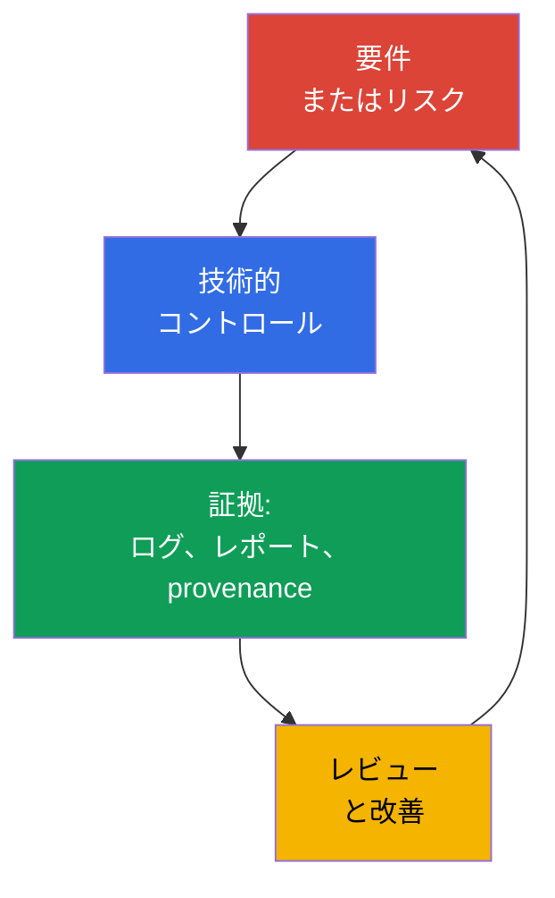
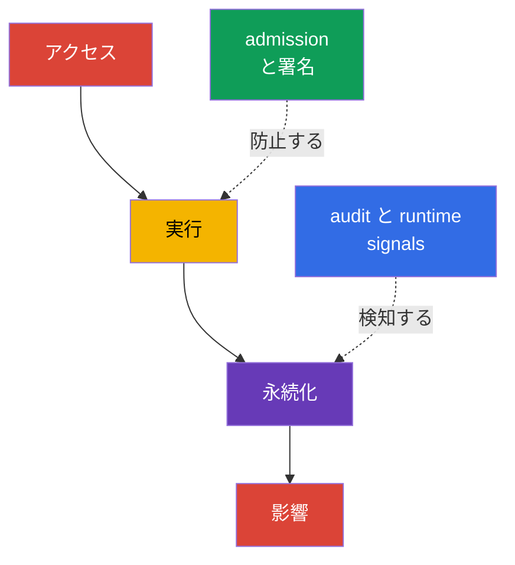

[Русская версия](ru.md) · [Eng version](README.md) · [Versión en español](es.md) · [Version française](fr.md) · [Deutsche Version](de.md) · [ქართული ვერსია](ge.md) · [繁體中文版](tw.md)

# 第19章. コンプライアンスとセキュリティフレームワーク

> **次に進む前に。** 第15-16章では脅威をモデル化して技術的コントロールに結び付け、第17-18章ではプラットフォームの保護を扱いました。ここでは、これらの対策をビジネス、監査人、開発チームに理解できる言葉にまとめます。すなわち、コンプライアンス要件、脅威モデル、アーティファクトのprovenanceの証拠、自動化された検証です。これはKCSAの **Compliance and Security Frameworks** ドメインで、出題比率は10%です。例は Kubernetes `v1.36` を対象としています。

コンプライアンスはセキュリティと同義ではありません。要件への適合とは、組織が適用される規則、プロセス、およびそれらが実施された証拠を示せることです。セキュリティではさらに、実際の脅威に基づいて対策を選択し、その有効性を検証してインシデントに対応することが求められます。

## 19.1 コンプライアンスフレームワーク: 既成の Kubernetes 設定ではなく適用範囲

フレームワークは、期待されるプラクティス、コントロール目標、または必須要件の集合を定めます。これが単一の YAML マニフェストになることも、製品を自動的に安全にすることもありません。チームはまず適用範囲を決定します。どのデータ、サービス、サプライヤー、国が影響を受けるかです。次に、要件を Kubernetes、クラウド、CI/CD のコントロールおよび人に関するプロセスに対応付けます。

| フレームワークまたは制度 | 主な対象範囲 | 通常、証明が求められること | Kubernetes との関連例 |
|---|---|---|---|
| PCI DSS | 決済カードデータ | セグメンテーション、アクセス制限、データ保護、監視 | cardholder サービスの分離、RBAC、アクセスログ記録 |
| NIST | プラクティスのカタログおよびリスク管理。米国政府機関やこのアプローチを選択した組織でよく使用される | インベントリ、リスク評価、選択および検証されたコントロール | 脅威モデル、構成管理、incident response |
| HIPAA | 米国の保護対象医療情報 | PHI のための管理上、物理上、技術上の safeguards | least privilege、暗号化、医療データへのアクセス監査 |
| SOC 2 | Trust Services Criteria に基づくサービス組織の controls の監査評価 | Type I: 指定日時点での control design の suitability、Type II: 申告期間における controls の design と operating effectiveness | ロールベースのアクセス、change management、監視、CI/CD からの evidence |

PCI DSS と HIPAA は特定の種類のデータや活動では必須になり得ます。NIST はリスク管理の枠組みとしてよく用いられます。SOC 2 は controls に関する監査報告書であり、Kubernetes の技術標準ではありません。1 つのクラスターが同時に複数の要件の対象になることがあります。たとえば、`NetworkPolicy` は PCI DSS のセグメンテーションに有用ですが、それだけでコンプライアンス全体を証明するものではありません。適用範囲、CNI による適用の検証、変更履歴、違反の監視が必要です。

有用な推論の連鎖は次のようになります。「決済カードデータをすべてのワークロードからアクセス可能にしてはならない」→ ネットワーク経路と RBAC の制限 → policy 検証の結果、audit event、構成レビュー。こうして要件は、一般的な意図の一覧ではなく、検証可能なコントロールになります。

### フレームワーク、control、evidence を混同しない

MITRE ATT&CK は攻撃者の行動に関するナレッジベースであり、compliance standard ではありません。STRIDE は脅威への問いを立てる手法であり、Kubernetes control ではありません。CIS Kubernetes Benchmark は technical hardening benchmark であり、admission controller ではありません。PCI DSS は cardholder data を保護するための要件であり、Kubernetes configuration guide ではありません。要件は **requirement → control → evidence → review** という連鎖を通じて初めて有用になります。

## 19.2 STRIDE、MITRE ATT&CK for Containers、kill chain

脅威モデリングはツールからではなく、保護対象と信頼境界から始めます。Kubernetes では、クライアントと API Server、`Pod` と ServiceAccount、CI システムと registry、ワークロードとデータベースなどが対象になります。フレームワークは、典型的な攻撃経路を見落とさず、リスクをエンジニアとセキュリティチームに同じように説明するのに役立ちます。

**STRIDE** は脅威を6つの問いに分類します。

| STRIDE カテゴリ | システムへの問い | Kubernetes での例 |
|---|---|---|
| Spoofing | 攻撃者は別の identity を装えるか。 | 盗まれた ServiceAccount トークンまたは kubeconfig |
| Tampering | オブジェクトまたはアーティファクトを気付かれずに変更できるか。 | registry 内のイメージの改ざんまたは `Deployment` の変更 |
| Repudiation | 実行した操作を否認できるか。 | `RoleBinding` の変更に対する十分な audit logging がない |
| Information Disclosure | データを開示できるか。 | 必要なアクセスを超えた `Secret` の読み取り |
| Denial of Service | 可用性を枯渇させられるか。 | quota なしで多数の `Pod` を作成する |
| Elevation of Privilege | より多くの権限を取得できるか。 | privileged `Pod` の実行または過剰な `ClusterRole` |

MITRE ATT&CK for Containers は、コンテナ環境に対する観測可能な戦術と技術を記述します。これは適合性のチェックリストではなく、シナリオ、テレメトリ、検出を結び付けるためのナレッジベースです。たとえば、ある技術は credentials へのアクセス、コンテナ内でのコマンド実行、または Kubernetes API の悪用を示すことがあります。チームは、各一致がすでにインシデントを意味すると想定せず、自身のログ、runtime イベント、controls と対応付けます。

**Kill chain** は、攻撃を一連の段階として捉えます。たとえば、初期アクセスの取得、実行、永続化、権限昇格、標的への移動、影響です。このモデルは、最終的な被害より前にコントロールを置くのに役立ちます。イメージの署名と admission 検証は不適切なアーティファクトの起動リスクを低減し、audit log と runtime detection は起動後の操作を検知できます。実際の攻撃は必ずしも厳密な線形の流れに従わないため、kill chain は規則ではなく分析手段として使用します。

## 19.3 サプライチェーンコンプライアンス: SLSA と provenance

ソフトウェアサプライチェーンには、ソースコード、依存関係、ビルドシステム、registry、deployment、runtime が含まれます。リスクは各地点で発生します。依存関係に脆弱性がある場合があり、CI の credential が盗まれる場合があり、イメージタグがすでに別のアーティファクトを指している場合があります。コンプライアンスでは、イメージが「検証済み」であると主張するだけでなく、アーティファクトとその来歴の間にある検証可能な関連を保持することが重要です。

**SLSA v1.2** (Supply-chain Levels for Software Artifacts) は、独立した **Build** および **Source** tracks におけるサプライチェーン要件を定めます。各 track には固有のレベルと要件があるため、Build レベルを Source レベルに関する主張として使用することはできず、その逆も同様です。レベルは常に track とともに示します。特定の SLSA 要件で定められていない性質をレベルに帰してはいけません。Reproducible build はプロセスの有用な性質であり得ますが、SLSA レベルの普遍的な同義語ではありません。SLSA は脆弱性スキャンに代わるものでも、製品の法的認証でもありません。これは、必要な保証を表現するための言語です。

**Reproducible build** - 同じソース、定義された build environment、同じ build instructions があれば、独立した第三者が指定されたアーティファクトを bit-for-bit で同一に再現できるビルドです。Reproducibility は source → artifact の対応を独立して確認する助けになりますが、それ自体では信頼された signing identity を証明せず、provenance を置き換えず、SLSA Build または Source のレベルも定めません。

**Provenance** - アーティファクトの来歴に関する機械可読な記録です。そこには、ソース revision、builder、プロセスのパラメータ、入力、得られたイメージの digest を記載できます。検証者は provenance を組織の policy と照合します。信頼された pipeline が許可されたソースからイメージをビルドし、期待される digest に一致する場合、そのイメージは許可されます。署名は provenance に関する主張を気付かれない改ざんから保護しますが、それでも署名者の identity と鍵、または keyless 署名の仕組みは信頼する必要があります。

| アーティファクトまたは証拠 | 回答する問い | 判断例 |
|---|---|---|
| SBOM | 「イメージはどのコンポーネントから構成されるか。」 | 新しい CVE 発生時に影響を受けるイメージを検索する |
| イメージ digest | 「起動される不変のアーティファクトは正確にどれか。」 | `image@sha256:...` を使った deployment |
| 署名 | 「どの identity がアーティファクトを確認したか。」 | deployment 前の署名検証 |
| provenance | 「どこから、どのように宣言されたプロセスで取得されたか。」 | policy は信頼された builder と repository のみを許可する |
| SLSA v1.2 | 「指定された Build または Source track でどの要件が満たされているか。」 | policy と evidence が宣言された track とレベルを検証する |
| scan の結果 | 「検証時点でどの既知のリスクが発見されたか。」 | severity とコンテキストに基づく CVE 処理ルール |

これらの証拠と枠組みは相互に代替できません。SBOM は誰がイメージをビルドしたかを確認しません。署名は SBOM や provenance を置き換えません。provenance は署名ではありません。SLSA はこれらの artefact のいずれにも代わらず、指定された track の要件を定めます。Scan は未知の脆弱性がないことを証明しません。そのため成熟したプロセスでは、SBOM、署名、provenance、scan の結果を digest に結び付け、適用される SLSA track を別途記録し、レビューと調査のために evidence を保持します。

## 19.4 自動化とツール: 継続的な controls と evidence

単一のクラスターを手動で検証しても、すぐに古くなります。構成、イメージ、権限は次の監査が実施されるよりも頻繁に変化するためです。自動化は反復可能な検査を実行し、受け入れられない変更をブロックするか、evidence を生成します。許容可能なリスクと例外に関する人間の判断を不要にするものではありません。

| ツールまたは分類 | 目的 | 典型的な結果 |
|---|---|---|
| `kube-bench` | 構成を CIS Kubernetes Benchmark と照合する | 検査と逸脱に関するレポート |
| policy engine: OPA/Gatekeeper, Kyverno, ValidatingAdmissionPolicy | admission 時または事前に CI でオブジェクトを評価する | policy による allow、deny、audit、または警告 |
| CI/CD の scanner: Trivy および類似ツール | 既知の脆弱性、secrets、または安全でない設定を検出する | レポート、pipeline の gate、修正タスク |
| audit logging | Kubernetes API に対する操作を記録する | identity、verb、オブジェクト、時刻を含むイベント |
| asset および evidence inventory | クラスター、バージョン、policy、検証結果を結び付ける | レビュー、監査、調査のための資料 |

`kube-bench` は CIS の推奨事項を検査して逸脱を報告しますが、クラスターを修正するものでも、推奨事項の適用可能性の評価を置き換えるものでもありません。Policy engine は privileged `Pod` や未許可の registry からのイメージを拒否できますが、誤った policy は正当な deployment を妨げる可能性があります。そのため policy はレビューを受け、代表的なマニフェストでテストされ、段階的に導入されます。最初は audit または warn とし、その後、合意された要件に対して enforce します。

Compliance evidence には、検証時刻、scope、tool/policy のバージョン、および検証対象の環境またはアーティファクトの識別子を保持する必要があります。evidence へのアクセスは不正な変更から制限します。より高い assurance のためには、append-only、immutable、または tamper-evident なストレージを使用します。そうしないと、後から保存された結果が実際に実行された検証に対応していることを確実に証明できません。

CI/CD では自動化は通常、短い経路で構築されます。ソースコードと依存関係の検査 → ビルド → SBOM と scan → 署名/provenance → digest による公開 → 起動前の policy 検証。クラスターでは audit と runtime-telemetry が、control が適用されたか、その deployment の後に何が起きたかについて、次のレビューのための事実を提供します。

## 19.5 実務での適用方法

決済サービスのチームは、カードデータを処理する namespace とストレージを特定します。それらに対して、PCI DSS の要件をコントロールに対応付けます。制限された RBAC、トラフィックのセグメンテーション、暗号化された接続、audit logging、例外を処理するプロセスです。CI では SBOM が作成され、イメージはスキャンされ、digest と provenance を取得します。Admission policy は、信頼された registry からの、来歴 policy に準拠するイメージのみを production で許可します。

場合によっては、特定のワークロードが一時的に標準 policy からの逸脱を必要とします。たとえば、診断または移行のための昇格された権限です。このような例外が管理されたリスクであり続けるのは、非公式に付与されるのではなく、文書化され検証可能な場合だけです。検証可能な例外の最小モデルには5つの要素があります。**owner** (例外に責任を持ち、その状態を確認できる人物)、**scope** (例外の対象となる正確なワークロード、namespace、または条件と、明示的に対象外となるもの)、**expiry** (個別の延長なしには例外が効力を失う日付または条件)、**approval** (誰がいつ標準 policy からの逸脱を承認したか)、および **compensating controls** (例外の有効期間中にリスクを低減する追加措置。強化された audit、制限されたネットワークアクセス、追加の monitoring など) です。これらの要素のいずれかがない例外は、その後のレビューや監査で policy からの制御されていない逸脱と区別することが困難です。

並行して、security チームは「開発者 → CI → registry → `Pod` → データベース」という経路について小さな STRIDE モデルを構築します。Tampering については pipeline の保護とアーティファクトの署名を検証します。Information Disclosure については `Secret` へのアクセスとログを確認します。Elevation of Privilege については RBAC と privileged workloads を防ぐ policy を確認します。定期的に、`kube-bench` のレポート、policy の結果、audit events のサンプルをシステム所有者と話し合います。このように自動化は入力データを提供しますが、リスクの所有者はチームのままです。

## 19.6 試験用語 / ミニ用語集

| 用語 | 簡単な意味 |
|---|---|
| compliance | 適用される外部および内部要件を、裏付けとなる証拠とともに満たすこと |
| control | リスクを低減する、または要件を満たす技術的もしくはプロセス上の対策 |
| evidence | control の動作に関する検証可能な痕跡。レポート、ログ、pipeline の記録、またはレビュー |
| kill chain | 防止と検出のポイントを見つけるために使われる攻撃段階のモデル |
| provenance | アーティファクトの来歴および作成プロセスに関する情報 |
| SLSA v1.2 | 独立した Build および Source tracks を持つ要件モデル。レベルは track と組み合わせた場合にのみ意味を持つ |
| STRIDE | 脅威モデル: Spoofing、Tampering、Repudiation、Information Disclosure、Denial of Service、Elevation of Privilege |

## 19.7 Exam Essentials / 章の要点

- コンプライアンスは適用される要件と controls の証拠を定めますが、実際のリスク管理を置き換えるものではありません。
- PCI DSS、HIPAA、NIST、SOC 2 は対象範囲と目的が異なります。適用可能性は、組織のデータ、活動、契約上の義務によって決まります。
- STRIDE は脅威の分類を探す助けになり、MITRE ATT&CK for Containers はシナリオを戦術と技術に結び付け、kill chain は攻撃の可能な段階を示します。
- SLSA v1.2 は独立した Build および Source tracks を分けます。SBOM、digest、署名、provenance、scan は異なる問いに答えるものであり、相互に代替できません。Reproducible build は SLSA レベルの普遍的な同義語ではありません。
- `kube-bench`、policy engines、CI/CD scanners、audit logging は検査を反復可能にして evidence を保存しますが、リスクに応じたレビューと設定が必要です。

## 19.8 混同しやすい点と試験での出題方法

問題では通常、要件またはシナリオが説明され、最も適切な用語または control を選ぶよう求められます。フレームワークの対象範囲と具体的な実装を区別してください。PCI DSS は `NetworkPolicy` ではなく、`kube-bench` だけでコンプライアンスを満たすわけでもありません。サプライチェーンのアーティファクトの違いを覚えておきましょう。SBOM は構成を説明し、digest は特定のコンテンツを識別し、署名は主張を identity と結び付け、provenance は宣言されたビルド経路を説明します。SLSA v1.2 は Build と Source tracks の要件を独立して定め、これらのアーティファクトを置き換えるものではありません。reproducible build は SLSA レベルの普遍的な同義語ではありません。

典型的な落とし穴は、あらゆる security ツールを防止手段と呼ぶことです。Audit log は主に evidence を作成して調査を支援しますが、admission policy はオブジェクトが作成される前に拒否できます。もう1つの落とし穴は、ATT&CK や STRIDE を必須の controls の一覧とみなすことです。これらは分析と共通用語のためのモデルであり、controls はリスクと要件に基づいて選択されます。

## 19.9 自己確認問題

### 1. PCI DSS の目的を最も正確に説明する記述はどれですか。

   - a. これはコンテナに対する攻撃段階のモデルである。
   - b. これは決済カードデータを処理する組織のためのセキュリティ要件の集合である。
   - c. これはコンテナイメージの SBOM 形式である。
   - d. これは Kubernetes の admission control の仕組みである。

回答と解説

**正解: b.** PCI DSS は決済カードデータの保護に関係します。セグメンテーション、アクセス制御、監査を要求することがありますが、1 つの Kubernetes リソースやアーティファクト形式を定義するものではありません。

### 2. 「このイメージはどのソース revision から、どの builder によって作成されたか」という問いに最もよく答える要素はどれですか。

   - a. `NetworkPolicy`。
   - b. API Server の Audit event。
   - c. Provenance。
   - d. SBOM。

回答と解説

**正解: c.** Provenance は来歴とビルドプロセスを説明します。SBOM はコンポーネントを列挙し、audit event はクラスター API に対する操作を記録します。

### 3. どの例が STRIDE の Elevation of Privilege カテゴリに該当しますか。

   - a. 攻撃者が別のユーザーの盗まれたトークンを使用する。
   - b. ワークロードが privileged `Pod` を実行できるようになる。
   - c. ログに `RoleBinding` を変更した人物の情報がない。
   - d. registry のイメージが別の内容に置き換えられた。

回答と解説

**正解: b.** より高い権限で操作を実行できるようになることは Elevation of Privilege に該当します。選択肢 a は Spoofing (盗んだトークンを通じた他者の identity の使用)、選択肢 c は Repudiation (変更者を特定できないこと)、選択肢 d は Tampering (イメージ内容の未承認の変更) に該当します。

### 4. コンプライアンスプログラムにおける `kube-bench` の正しい役割は何ですか。

   - a. etcd 内のすべての `Secret` を自動的に暗号化する。
   - b. イメージに署名して provenance を作成する。
   - c. 監査人と controls の適用可能性評価を置き換える。
   - d. 構成を CIS の推奨事項と照合し、逸脱に関するレポートを作成する。

回答と解説

**正解: d.** `kube-bench` は CIS の推奨事項を検証する助けになります。結果には解釈が必要です。推奨事項の一部はマネージドクラスターに適用できないことがあり、修正とリスク受容は組織の責任として残ります。

### 5. サプライチェーンに関するレポートで SLSA v1.2 を正しく説明する evidence はどれですか。

   - a. 署名があることを記載し、それが provenance、SBOM、scan の結果、および適用される SLSA track の個別の宣言に代わるものとみなす。

   - b. 適用される Build または Source track とそのレベルを記載し、関連する evidence は各証拠の目的に応じて別途保持する。

   - c. SBOM があることを記載し、それに基づいて追加の evidence なしに Build と Source tracks の両方に同じ SLSA level を割り当てる。

   - d. reproducible build を記載し、選択された track、provenance、レベル要件にかかわらず、これを普遍的な SLSA level として使用する。

回答と解説

**正解: b.** SLSA v1.2 には、それぞれのレベルと要件を持つ別個の Build および Source tracks があります。したがって、レベルは特定の track とともに示します。

SBOM、signature、provenance、scan の結果は異なる問いに答えるものであり、SLSA を使用するだけで相互に代替可能になるわけではありません。Reproducible build も SLSA level の普遍的な表現ではありません。

> **次に進むには。** CIS Benchmark の実践的な検証については CKS の第07章を使用してください。admission control のシナリオは CKS の第20章で扱います。supply chain、SBOM、署名、policy は CKS の第25-28章で扱います。audit logging の設定と分析には CKS の第32章を使用してください。

[目次](../README_JP.md) · [第18章](../18/jp.md) · [第20章](../20/jp.md)