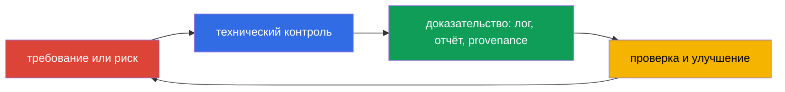
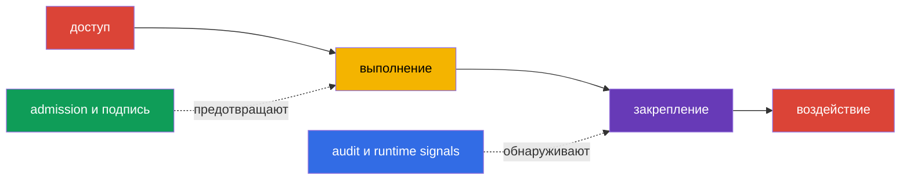

> **Язык:** русский. Переводы будут добавлены после публикации соответствующих файлов.

# Глава 19. Комплаенс и фреймворки безопасности

> **Что дальше.** В главах 15-16 мы моделировали угрозы и связывали их с техническими контролями, а в главах 17-18 рассмотрели защиту платформы. Теперь соберём эти меры в язык, понятный бизнесу, аудиторам и командам разработки: требования комплаенса, модели угроз, доказательства происхождения артефактов и автоматизированные проверки. Это домен KCSA **Compliance and Security Frameworks** с весом 10%. Примеры ориентированы на Kubernetes `v1.36`.

Комплаенс не равен безопасности. Соответствие требованиям означает, что организация может показать применимые правила, процессы и доказательства их выполнения. Безопасность дополнительно требует выбирать меры по реальным угрозам, проверять их эффективность и реагировать на инциденты.

## 19.1 Фреймворки комплаенса: область, а не готовая настройка Kubernetes

Фреймворк задаёт набор ожидаемых практик, целей контроля или обязательных требований. Он не превращается в один YAML-манифест и не делает продукт автоматически безопасным. Команда сначала определяет применимую область: какие данные, сервисы, поставщики и страны затронуты. Затем сопоставляет требования с контролями Kubernetes, облака, CI/CD и процессами людей.

| Фреймворк или режим | Основная область | Что обычно требуется доказать | Пример связи с Kubernetes |
|---|---|---|---|
| PCI DSS | данные платёжных карт | сегментацию, ограничение доступа, защиту данных, мониторинг | изоляция cardholder-сервисов, RBAC, журналирование доступа |
| NIST | каталог практик и управление рисками, часто для госорганизаций США и организаций, выбравших этот подход | инвентаризацию, оценку риска, выбранные и проверяемые контроли | модель угроз, управление конфигурацией, incident response |
| HIPAA | защищаемая медицинская информация в США | административные, физические и технические safeguards для PHI | least privilege, шифрование, аудит доступа к медицинским данным |
| SOC 2 | проверка controls сервисной организации по Trust Services Criteria | что controls спроектированы и работают в заявленный период | доступ по ролям, change management, мониторинг, evidence из CI/CD |

PCI DSS и HIPAA могут быть обязательны для определённого вида данных и деятельности; NIST часто служит структурой управления риском; SOC 2 является аудиторским отчётом об controls, а не техническим стандартом Kubernetes. Один кластер может одновременно попадать под несколько требований. Например, `NetworkPolicy` полезна для сегментации PCI DSS, но сама по себе не доказывает весь комплаенс: нужны область действия, проверка применения CNI, история изменений и наблюдение за нарушениями.

Полезная цепочка рассуждений выглядит так: «данные платёжной карты не должны быть доступны всем рабочим нагрузкам» → ограничение сетевых путей и RBAC → результат policy-проверки, audit event и ревью конфигурации. Так требование становится проверяемым контролем, а не списком общих намерений.

### Не путать фреймворк, control и evidence

MITRE ATT&CK - база знаний о поведении атакующего, а не compliance standard. STRIDE - метод постановки вопросов к угрозам, а не Kubernetes control. CIS Kubernetes Benchmark - technical hardening benchmark, а не admission controller. PCI DSS - требования к защите cardholder data, а не Kubernetes configuration guide. Требование становится полезным только через цепочку **requirement → control → evidence → review**.

## 19.2 STRIDE, MITRE ATT&CK for Containers и kill chain

Моделирование угроз начинает не с инструмента, а с объекта защиты и границ доверия. Для Kubernetes это могут быть клиент и API Server, `Pod` и ServiceAccount, CI-система и registry, рабочая нагрузка и база данных. Фреймворки помогают не пропустить типовые пути атаки и одинаково описывать риск инженерам и службе безопасности.

**STRIDE** группирует угрозы по шести вопросам:

| Категория STRIDE | Вопрос к системе | Пример в Kubernetes |
|---|---|---|
| Spoofing | Может ли атакующий выдать себя за другую identity? | украденный токен ServiceAccount или kubeconfig |
| Tampering | Может ли он незаметно изменить объект или артефакт? | подмена образа в registry или изменение `Deployment` |
| Repudiation | Можно ли отрицать выполненное действие? | отсутствие достаточного audit logging для изменения `RoleBinding` |
| Information Disclosure | Можно ли раскрыть данные? | чтение `Secret` сверх необходимого доступа |
| Denial of Service | Можно ли истощить доступность? | создание множества `Pod` без quota |
| Elevation of Privilege | Можно ли получить больше прав? | запуск privileged `Pod` или чрезмерный `ClusterRole` |

MITRE ATT&CK for Containers описывает наблюдаемые тактики и техники против контейнерных сред. Это не чек-лист соответствия, а база знаний для связи сценария, телеметрии и детекта. Например, техника может указывать на доступ к credentials, выполнение команды в контейнере или злоупотребление API Kubernetes. Команда сопоставляет её со своими логами, событиями runtime и controls, не предполагая, что каждое совпадение уже означает инцидент.

**Kill chain** рассматривает атаку как последовательность этапов, например получение первоначального доступа, выполнение, закрепление, повышение привилегий, движение к цели и воздействие. Модель помогает поставить контроль раньше финального ущерба: подпись образа и проверка admission уменьшают риск запуска неподходящего артефакта, а audit log и runtime detection могут заметить действия после запуска. Реальные атаки не обязаны идти строго по линейной схеме, поэтому kill chain используют как средство анализа, а не как правило.

## 19.3 Комплаенс цепочки поставок: SLSA и provenance

Цепочка поставок ПО включает исходный код, зависимости, систему сборки, registry, deployment и runtime. Риск возникает в каждой точке: зависимость может быть уязвимой, credential CI может быть украден, а тег образа может указывать уже на другой артефакт. Для комплаенса важно не только утверждать, что образ «проверен», но и сохранять проверяемую связь между артефактом и его происхождением.

**SLSA v1.2** (Supply-chain Levels for Software Artifacts) задаёт требования к цепочке поставок в независимых tracks **Build** и **Source**. У каждого track свои уровни и требования, поэтому уровень Build нельзя использовать как утверждение об уровне Source, и наоборот; уровень всегда указывают вместе с track. Не следует приписывать уровню свойства, которые не заданы конкретным требованием SLSA. Reproducible build может быть полезным свойством процесса, но не является универсальным синонимом уровня SLSA. SLSA не заменяет сканирование уязвимостей и не является юридической сертификацией продукта. Это язык для формулирования требуемых гарантий.

**Provenance** - машиночитаемая запись о происхождении артефакта. В ней могут быть указаны исходный revision, builder, параметры процесса, входы и digest полученного образа. Проверяющий сопоставляет provenance с политикой организации: образ разрешён, если его собрал доверенный pipeline из разрешённого источника и он соответствует ожидаемому digest. Подпись защищает утверждение о provenance от незаметной подмены, но доверять всё равно нужно identity подписавшего и ключам или механизму keyless-подписи.

| Артефакт или доказательство | На какой вопрос отвечает | Пример решения |
|---|---|---|
| SBOM | «Из каких компонентов состоит образ?» | поиск затронутых образов при новой CVE |
| digest образа | «Какой именно неизменяемый артефакт запускается?» | deployment с `image@sha256:...` |
| подпись | «Какая identity подтвердила артефакт?» | проверка подписи перед deployment |
| provenance | «Откуда и каким заявленным процессом он получен?» | policy разрешает только доверенный builder и repository |
| SLSA v1.2 | «Какие требования выполнены в указанном track Build или Source?» | policy и evidence проверяют заявленный track и уровень |
| результат scan | «Какие известные риски найдены на момент проверки?» | правило обработки CVE по severity и контексту |

Эти доказательства и рамки не взаимозаменяемы. SBOM не подтверждает, кто собрал образ; подпись не заменяет SBOM или provenance; provenance не является подписью; SLSA не заменяет ни один из этих artefact, а задаёт требования к указанному track. Scan не доказывает отсутствие неизвестных уязвимостей. Поэтому зрелый процесс связывает SBOM, подпись, provenance и результаты scan с digest, отдельно фиксирует применимый track SLSA и сохраняет evidence для ревью и расследования.

## 19.4 Автоматизация и инструменты: непрерывные controls и evidence

Ручная проверка одного кластера быстро устаревает: конфигурации, образы и права меняются чаще, чем проходит очередной аудит. Автоматизация выполняет повторяемые проверки, блокирует неприемлемые изменения или формирует evidence. Она не отменяет решения человека о допустимом риске и исключениях.

| Инструмент или класс | Назначение | Типичный результат |
|---|---|---|
| `kube-bench` | сопоставляет конфигурацию с CIS Kubernetes Benchmark | отчёт о проверках и отклонениях |
| policy engine: OPA/Gatekeeper, Kyverno, ValidatingAdmissionPolicy | оценивает объекты при admission или заранее в CI | allow, deny, audit или предупреждение по policy |
| scanner в CI/CD: Trivy и аналоги | ищет известные уязвимости, secrets или небезопасные настройки | отчёт, gate для pipeline, задача на исправление |
| audit logging | фиксирует действия с API Kubernetes | событие с identity, verb, объектом и временем |
| asset и evidence inventory | связывает кластер, версию, policy и результаты проверки | материал для ревью, аудита и расследования |

`kube-bench` проверяет рекомендации CIS и сообщает об отклонении, но не исправляет кластер и не заменяет оценку применимости рекомендации. Policy engine может запретить privileged `Pod` или образ из неразрешённого registry, однако ошибочная policy способна нарушить легитимный deployment. Поэтому policy проходят ревью, тестируются на типовых манифестах и вводятся поэтапно: сначала audit или warn, затем enforce для согласованного требования.

В CI/CD автоматизация обычно строит короткий путь: проверка исходного кода и зависимостей → сборка → SBOM и scan → подпись/provenance → публикация по digest → policy-проверка перед запуском. В кластере audit и runtime-telemetry дают следующему ревью факты о том, был ли control применён и что произошло после deployment.

## 19.5 Как это применяют на практике

Команда платежного сервиса определяет namespace и хранилища, которые обрабатывают данные карты. Для них она связывает требования PCI DSS с контролями: ограниченный RBAC, сегментация трафика, шифрованные соединения, audit logging и процесс обработки исключений. В CI создаётся SBOM, образ сканируется, получает digest и provenance. Admission policy допускает в production только образы из доверенного registry, соответствующие политике происхождения.

Иногда конкретной рабочей нагрузке временно требуется отступление от стандартной policy, например повышенные привилегии для диагностики или миграции. Такое исключение остаётся управляемым риском только тогда, когда оно документировано и проверяемо, а не выдано неформально. Минимальная модель проверяемого исключения включает пять элементов: **owner** (кто отвечает за исключение и может подтвердить его статус), **scope** (какая именно рабочая нагрузка, namespace или условие покрыты исключением, а что явно не покрыто), **expiry** (дата или условие, после которого исключение перестаёт действовать без отдельного продления), **approval** (кто и когда одобрил отступление от стандартной policy) и **compensating controls** (какие дополнительные меры - усиленный audit, ограниченный сетевой доступ, дополнительный monitoring - снижают риск на время действия исключения). Исключение без одного из этих элементов сложно отличить от неконтролируемого отступления от policy при последующем ревью или аудите.

Параллельно security-команда строит небольшую модель STRIDE для пути «разработчик → CI → registry → `Pod` → база данных». Для Tampering она проверяет защиту pipeline и подпись артефактов; для Information Disclosure - доступы к `Secret` и логи; для Elevation of Privilege - RBAC и policy против privileged workloads. Раз в период отчёты `kube-bench`, результаты policy и выборка audit events обсуждаются с владельцами систем. Так автоматизация даёт входные данные, но владельцем риска остаётся команда.

## 19.6 Exam vocabulary / Мини-глоссарий

| Термин | Краткое значение |
|---|---|
| compliance | выполнение применимых внешних и внутренних требований с подтверждающими доказательствами |
| control | техническая или процессная мера, уменьшающая риск или обеспечивающая требование |
| evidence | проверяемый след работы control: отчёт, лог, запись pipeline или ревью |
| kill chain | модель этапов атаки, используемая для поиска точек предотвращения и обнаружения |
| provenance | сведения о происхождении и процессе создания артефакта |
| SLSA v1.2 | модель требований с независимыми tracks Build и Source; уровень значим только вместе с track |
| STRIDE | модель угроз: Spoofing, Tampering, Repudiation, Information Disclosure, Denial of Service, Elevation of Privilege |

## 19.7 Exam Essentials / Итоги главы

- Комплаенс задаёт применимые требования и доказательства controls, но не заменяет управление реальными рисками.
- PCI DSS, HIPAA, NIST и SOC 2 различаются областью и назначением; применимость определяется данными, деятельностью и договорными обязательствами организации.
- STRIDE помогает искать классы угроз, MITRE ATT&CK for Containers связывает сценарии с тактиками и техниками, а kill chain показывает возможные этапы атаки.
- SLSA v1.2 разделяет независимые tracks Build и Source; SBOM, digest, подпись, provenance и scan отвечают на разные вопросы и не взаимозаменяемы. Reproducible build не является универсальным синонимом уровня SLSA.
- `kube-bench`, policy engines, CI/CD scanners и audit logging делают проверки повторяемыми и сохраняют evidence, но требуют ревью и настройки под риск.

## 19.8 Не путать и как это встречается на экзамене

Вопрос обычно описывает требование или сценарий и просит выбрать наиболее подходящий термин либо контроль. Отличайте область фреймворка от конкретной реализации: PCI DSS не является `NetworkPolicy`, а `kube-bench` не обеспечивает комплаенс сам по себе. Помните различия артефактов supply chain: SBOM описывает состав, digest идентифицирует конкретный контент, подпись связывает утверждение с identity, provenance описывает заявленный путь сборки. SLSA v1.2 задаёт требования независимо для tracks Build и Source, не заменяя эти артефакты; reproducible build не является универсальным синонимом уровня SLSA.

Типичная ловушка - назвать любой security-инструмент средством предотвращения. Audit log в первую очередь создаёт evidence и помогает расследованию, тогда как admission policy может не допустить объект до создания. Ещё одна ловушка - считать ATT&CK или STRIDE перечнем обязательных controls. Это модели для анализа и общая терминология, а controls выбирают по риску и требованиям.

## 19.9 Вопросы для самопроверки

### 1. Какое утверждение точнее всего описывает назначение PCI DSS?

a. Это модель стадий атаки на контейнер.
b. Это набор требований безопасности для организаций, обрабатывающих данные платёжных карт.
c. Это формат SBOM для контейнерных образов.
d. Это механизм admission control в Kubernetes.

Ответ и разбор

**Верный ответ: b.** PCI DSS относится к защите данных платёжных карт. Он может потребовать сегментации, контроля доступа и аудита, но не определяет один Kubernetes-ресурс или формат артефакта.

### 2. Какой элемент лучше всего отвечает на вопрос «из какого исходного revision и каким builder был создан этот образ»?

a. `NetworkPolicy`.
b. Audit event API Server.
c. Provenance.
d. SBOM.

Ответ и разбор

**Верный ответ: c.** Provenance описывает происхождение и процесс сборки. SBOM перечисляет компоненты, а audit event фиксирует действие с API кластера.

### 3. Какой пример относится к категории STRIDE Elevation of Privilege?

a. Атакующий использует украденный токен другого пользователя.
b. Рабочая нагрузка получает возможность запускать privileged `Pod`.
c. В журнале нет данных, кто изменил `RoleBinding`.
d. Образ в registry заменён другим содержимым.

Ответ и разбор

**Верный ответ: b.** Получение возможности выполнить действие с более высокими правами относится к Elevation of Privilege. Вариант a соответствует Spoofing (использование чужой личности через похищенный токен), вариант c - Repudiation (невозможность установить автора изменения), а вариант d - Tampering (несогласованное изменение содержимого образа).

### 4. Какова корректная роль `kube-bench` в программе комплаенса?

a. Он автоматически шифрует все `Secret` в etcd.
b. Он подписывает образы и создаёт provenance.
c. Он заменяет аудитора и оценку применимости controls.
d. Он сопоставляет конфигурацию с рекомендациями CIS и формирует отчёт об отклонениях.

Ответ и разбор

**Верный ответ: d.** `kube-bench` помогает проверять рекомендации CIS. Результат нуждается в интерпретации: часть рекомендаций может быть неприменима к управляемому кластеру, а исправление и принятие риска остаются задачей организации.

### 5. Какое evidence корректно описывает SLSA v1.2 в отчёте о supply chain?

a. Подпись артефакта заменяет provenance и все требования SLSA.

b. Нужно указать применимый track Build или Source, его уровень и отдельно сохранить SBOM, подпись, provenance и результаты scan по их назначению.

c. Достаточно указать, что образ имеет SBOM: это одновременно доказывает track Build и Source.

d. Достаточно отметить reproducible build: это универсально определяет уровень SLSA.

Ответ и разбор

**Верный ответ: b.** SLSA v1.2 разделяет независимые tracks Build и Source. SBOM, подпись, provenance и scan отвечают на разные вопросы и не взаимозаменяемы; reproducible build не является универсальным обозначением уровня SLSA.

> **Куда дальше.** Для практической проверки CIS Benchmark перейдите к [главе 07 CKS](../../../cks/course/07/ru.md). Сценарии admission control разобраны в [главе 20 CKS](../../../cks/course/20/ru.md); supply chain, SBOM, подписи и policy - в [главах 25](../../../cks/course/25/ru.md), [26](../../../cks/course/26/ru.md), [27](../../../cks/course/27/ru.md) и [28](../../../cks/course/28/ru.md) CKS. Для настройки и анализа audit logging используйте [главу 32 CKS](../../../cks/course/32/ru.md).

[Оглавление](../README_RU.md) · [Глава 18](../18/ru.md) · [Глава 20](../20/ru.md)
