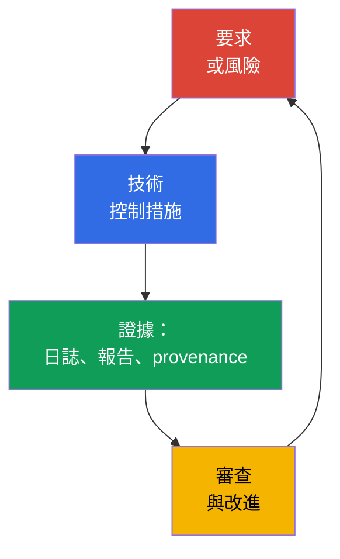
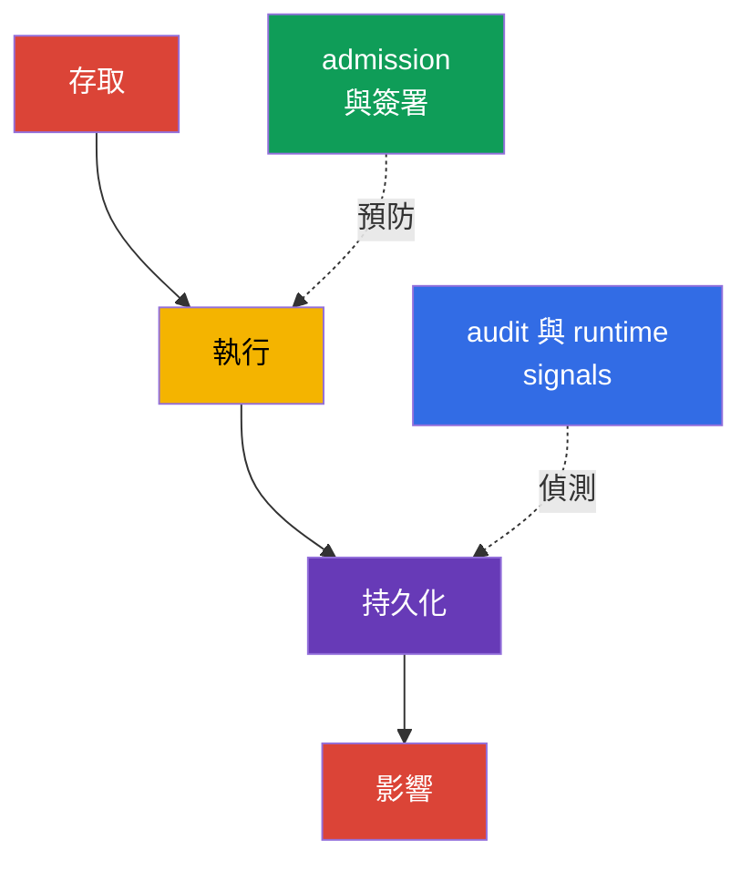

[Русская версия](ru.md) · [Eng version](README.md) · [Versión en español](es.md) · [Version française](fr.md) · [Deutsche Version](de.md) · [ქართული ვერსია](ge.md) · [日本語版](jp.md)

# 第 19 章。合規與安全框架

> **接下來。** 在第 15-16 章中，我們進行威脅建模並將其連結至技術控制措施；在第 17-18 章中，我們探討了平台防護。現在，我們會將這些措施整理為企業、稽核人員與開發團隊都能理解的語言：合規要求、威脅模型、成品來源證明與自動化檢查。這是 KCSA **Compliance and Security Frameworks** 領域，占比為 10%。範例以 Kubernetes `v1.36` 為準。

合規不等於安全。符合要求代表組織能展示適用的規則、流程，以及其已執行的證據。安全還要求依據真實威脅選擇措施、驗證其有效性並回應事件。

## 19.1 合規框架：範圍，而非現成的 Kubernetes 設定

框架定義一組預期實務、控制目標或強制要求。它不會轉變成單一 YAML manifest，也不會使產品自動變得安全。團隊首先界定適用範圍：涉及哪些資料、服務、供應商與國家。接著，將要求對應至 Kubernetes、雲端、CI/CD 的控制措施與人員流程。

| 框架或制度 | 主要範圍 | 通常需要證明的內容 | 與 Kubernetes 的連結範例 |
|---|---|---|---|
| PCI DSS | 支付卡資料 | 區隔、存取限制、資料防護、監控 | cardholder 服務的隔離、RBAC、存取記錄 |
| NIST | 實務目錄與風險管理，常用於美國政府機構及選擇此方法的組織 | 資產清冊、風險評估、已選定且可驗證的控制措施 | 威脅模型、組態管理、incident response |
| HIPAA | 美國受保護健康資訊 | PHI 的行政、實體與技術 safeguards | least privilege、加密、醫療資料存取稽核 |
| SOC 2 | 依 Trust Services Criteria 對服務組織 controls 進行的稽核評估 | Type I：指定日期的 control design 適當性；Type II：所述期間的 controls 設計與 operating effectiveness | 依角色存取、change management、監控、CI/CD 的 evidence |

PCI DSS 與 HIPAA 可能對特定資料類型與活動具有強制性；NIST 常作為風險管理架構；SOC 2 是關於 controls 的稽核報告，而非 Kubernetes 技術標準。單一叢集可能同時受到多項要求約束。例如，`NetworkPolicy` 有助於 PCI DSS 的區隔，但它本身不足以證明完整合規：仍需要適用範圍、CNI 套用情況的驗證、變更歷程與違規觀測。

一條有用的推理鏈如下：「支付卡資料不應讓所有工作負載存取」→ 限制網路路徑與 RBAC → policy 檢查結果、audit event 與組態審查。如此一來，要求就會成為可驗證的控制措施，而非一份籠統意向清單。

### 不要混淆 framework、control 與 evidence

MITRE ATT&CK 是關於攻擊者行為的知識庫，而非 compliance standard。STRIDE 是提出威脅問題的方法，而非 Kubernetes control。CIS Kubernetes Benchmark 是 technical hardening benchmark，而非 admission controller。PCI DSS 是保護 cardholder data 的要求，而非 Kubernetes configuration guide。要求唯有經由 **requirement → control → evidence → review** 鏈條才具有實用價值。

## 19.2 STRIDE、MITRE ATT&CK for Containers 與 kill chain

威脅建模不是從工具開始，而是從受保護的對象與信任邊界開始。對 Kubernetes 而言，這些可以是用戶端與 API Server、`Pod` 與 ServiceAccount、CI 系統與 registry、工作負載與資料庫。框架協助避免遺漏常見攻擊路徑，並以一致方式向工程師與安全團隊描述風險。

**STRIDE** 依六個問題歸類威脅：

| STRIDE 類別 | 對系統的問題 | Kubernetes 範例 |
|---|---|---|
| Spoofing | 攻擊者能否冒充另一個 identity？ | 遭竊的 ServiceAccount token 或 kubeconfig |
| Tampering | 他能否在不被察覺下變更物件或成品？ | 替換 registry 中的映像或修改 `Deployment` |
| Repudiation | 是否可以否認已執行的動作？ | 缺乏足夠的 audit logging 來記錄 `RoleBinding` 變更 |
| Information Disclosure | 是否可以洩露資料？ | 讀取超出必要存取權限的 `Secret` |
| Denial of Service | 是否可以耗盡可用性？ | 不受 quota 限制地建立大量 `Pod` |
| Elevation of Privilege | 是否可以取得更多權限？ | 執行 privileged `Pod` 或權限過大的 `ClusterRole` |

MITRE ATT&CK for Containers 描述針對容器環境可觀察到的戰術與技術。它不是合規檢查清單，而是用來連結情境、遙測資料與偵測的知識庫。例如，某項技術可能指向對 credentials 的存取、在容器中執行命令，或濫用 Kubernetes API。團隊將它與自身日誌、runtime events 及 controls 對應，而不假設每次比對都已代表事件。

**Kill chain** 將攻擊視為一連串階段，例如取得初始存取權、執行、持久化、提升權限、往目標移動及造成影響。該模型有助於在最終損害前部署控制措施：映像簽署與 admission 檢查可降低執行不適當成品的風險，而 audit log 與 runtime detection 可以注意到執行後的動作。真實攻擊不必嚴格遵循線性順序，因此 kill chain 應作為分析工具，而非規則。

## 19.3 軟體供應鏈合規：SLSA 與 provenance

軟體供應鏈涵蓋原始碼、相依性、建置系統、registry、deployment 與 runtime。每個環節都有風險：相依性可能有漏洞、CI credential 可能遭竊，而映像 tag 可能已指向其他成品。就合規而言，重要的不僅是聲稱映像「已檢查」，還要保留成品與其來源之間可驗證的連結。

**SLSA v1.2**（Supply-chain Levels for Software Artifacts）定義供應鏈要求，且具有彼此獨立的 **Build** 與 **Source** tracks。每個 track 有自己的層級與要求，因此 Build 層級不能用來宣稱 Source 層級，反之亦然；層級一律要連同 track 一起指出。不得將特定 SLSA 要求未定義的特性歸屬於某個層級。Reproducible build 可以是流程的有益特性，但不是 SLSA 層級的通用同義詞。SLSA 不取代漏洞掃描，也不是產品的法律認證。它是用於陳述所需保證的語言。

**Reproducible build** - 在相同原始碼、已定義的 build environment 和相同 build instructions 下，獨立一方能重現 bit-for-bit 相同指定成品的建置。Reproducibility 有助於獨立核對 source → artifact 的相符性，但它本身不證明受信任的 signing identity、不取代 provenance，也不定義 SLSA Build 或 Source 層級。

**Provenance** - 關於成品來源的機器可讀紀錄。其中可包含原始 revision、builder、流程參數、輸入及產出映像的 digest。驗證者將 provenance 與組織 policy 比對：映像僅在由受信任 pipeline 從允許來源建置，且符合預期 digest 時才獲准。簽署可保護 provenance 的宣告不受未察覺的竄改，但仍必須信任簽署者的 identity，以及其金鑰或 keyless signing 機制。

| 成品或證據 | 回答的問題 | 決策範例 |
|---|---|---|
| SBOM | 「映像由哪些元件組成？」 | 新 CVE 出現時尋找受影響的映像 |
| 映像 digest | 「正在執行的是哪一個精確且不可變的成品？」 | 使用 `image@sha256:...` 的 deployment |
| 簽署 | 「哪個 identity 確認了成品？」 | deployment 前驗證簽署 |
| provenance | 「它來自何處，以及經由何種已宣告的流程產生？」 | policy 僅允許受信任的 builder 與 repository |
| SLSA v1.2 | 「指定的 Build 或 Source track 符合哪些要求？」 | policy 與 evidence 檢查所宣告的 track 與層級 |
| scan 結果 | 「檢查時發現哪些已知風險？」 | 依 severity 與情境處理 CVE 的規則 |

這些證據與框架不可互相替代。SBOM 不確認誰建置了映像；簽署不取代 SBOM 或 provenance；provenance 不是簽署；SLSA 不取代這些任何一種 artifact，而是對指定 track 設定要求。Scan 不證明不存在未知漏洞。因此，成熟的流程會將 SBOM、簽署、provenance 與 scan 結果連結至 digest，另行記錄適用的 SLSA track，並保留 evidence 以供審查與調查。

## 19.4 自動化與工具：持續的 controls 與 evidence

手動檢查單一叢集很快會過時：組態、映像與權限的變更頻率高於下一次稽核。自動化執行可重複的檢查、阻擋不可接受的變更，或產生 evidence。它不會取代人類對可接受風險與例外的決策。

| 工具或類別 | 用途 | 典型結果 |
|---|---|---|
| `kube-bench` | 將組態與 CIS Kubernetes Benchmark 對應 | 檢查與偏差報告 |
| policy engine：OPA/Gatekeeper、Kyverno、ValidatingAdmissionPolicy | 在 admission 時或事先在 CI 中評估物件 | 依 policy allow、deny、audit 或 warning |
| CI/CD 中的 scanner：Trivy 及同類工具 | 尋找已知漏洞、secrets 或不安全設定 | 報告、pipeline gate、修正工作項目 |
| audit logging | 記錄 Kubernetes API 的操作 | 含有 identity、verb、物件與時間的事件 |
| asset 與 evidence inventory | 連結叢集、版本、policy 與檢查結果 | 供審查、稽核與調查的材料 |

`kube-bench` 檢查 CIS 建議並報告偏差，但不會修正叢集，也不取代對建議適用性的評估。Policy engine 可以拒絕 privileged `Pod` 或來自未允許 registry 的映像，但錯誤的 policy 可能破壞合法 deployment。因此，policy 須經審查、以典型 manifest 測試，並分階段導入：先採用 audit 或 warn，再針對已協調的要求 enforce。

Compliance evidence 應保留檢查時間、scope、tool/policy 版本，以及受檢環境或成品的識別碼。應限制未經授權變更 evidence 的存取；對較高 assurance，應採用 append-only、immutable 或 tamper-evident 儲存。否則，之後就無法可靠地證明保留的結果確實對應於實際執行的檢查。

在 CI/CD 中，自動化通常建立一條短路徑：原始碼與相依性檢查 → 建置 → SBOM 與 scan → 簽署/provenance → 依 digest 發布 → 執行前 policy 檢查。在叢集中，audit 與 runtime telemetry 為下一次審查提供事實，說明 control 是否已套用以及 deployment 後發生了什麼。

## 19.5 實務上的運用方式

支付服務團隊界定處理卡片資料的 namespace 與儲存區。對這些範圍，他們將 PCI DSS 要求連結至控制措施：受限的 RBAC、流量區隔、加密連線、audit logging 與例外處理流程。在 CI 中會建立 SBOM、掃描映像、取得 digest 與 provenance。Admission policy 僅允許來自受信任 registry 且符合來源 policy 的映像進入 production。

有時特定工作負載暫時需要偏離標準 policy，例如為診斷或遷移而提高權限。僅當這類例外有文件紀錄且可驗證，而非非正式授予時，它才仍是受管理的風險。可驗證例外的最小模型包含五項要素：**owner**（負責例外並可確認其狀態的人員）、**scope**（例外涵蓋的確切工作負載、namespace 或條件，以及明確不涵蓋的內容）、**expiry**（若未另行延長，例外不再有效的日期或條件）、**approval**（誰在何時核准偏離標準 policy）與 **compensating controls**（在例外有效期間降低風險的額外措施 - 強化 audit、限制網路存取、額外 monitoring）。缺少其中任一項的例外，在後續審查或稽核時很難與不受控制的 policy 偏離區分。

同時，安全團隊會為「開發人員 → CI → registry → `Pod` → 資料庫」路徑建立一個小型 STRIDE 模型。對於 Tampering，他們檢查 pipeline 防護與成品簽署；對於 Information Disclosure，檢查對 `Secret` 的存取及日誌；對於 Elevation of Privilege，檢查 RBAC 與防範 privileged workloads 的 policy。定期會與系統 owner 討論 `kube-bench` 報告、policy 結果與 audit events 抽樣。如此一來，自動化提供輸入資料，但團隊仍是風險的 owner。

## 19.6 Exam vocabulary / 迷你詞彙表

| 術語 | 簡要含義 |
|---|---|
| compliance | 以佐證證據履行適用的外部與內部要求 |
| control | 降低風險或滿足要求的技術或流程措施 |
| evidence | control 運作的可驗證痕跡：報告、日誌、pipeline 紀錄或審查 |
| kill chain | 用於尋找預防與偵測點的攻擊階段模型 |
| provenance | 關於成品來源與建立流程的資訊 |
| SLSA v1.2 | 具有獨立 Build 與 Source tracks 的要求模型；層級僅在與 track 一起使用時才有意義 |
| STRIDE | 威脅模型：Spoofing、Tampering、Repudiation、Information Disclosure、Denial of Service、Elevation of Privilege |

## 19.7 Exam Essentials / 本章重點

- 合規定義適用要求與 controls 的證據，但不取代對真實風險的管理。
- PCI DSS、HIPAA、NIST 與 SOC 2 的範圍和用途不同；適用性取決於組織的資料、活動與合約義務。
- STRIDE 協助尋找威脅類別，MITRE ATT&CK for Containers 將情境連結至戰術與技術，而 kill chain 顯示可能的攻擊階段。
- SLSA v1.2 區分獨立的 Build 與 Source tracks；SBOM、digest、簽署、provenance 與 scan 回答不同問題，無法互相替代。Reproducible build 不是 SLSA 層級的通用同義詞。
- `kube-bench`、policy engines、CI/CD scanners 與 audit logging 使檢查可重複並保留 evidence，但仍需要依風險進行審查與設定。

## 19.8 不要混淆，以及它在考試中的呈現方式

題目通常描述一項要求或情境，並要求選擇最合適的術語或 control。請區分 framework 的範圍與具體實作：PCI DSS 不是 `NetworkPolicy`，而 `kube-bench` 本身不會實現合規。記住 supply chain artifact 的差異：SBOM 描述組成、digest 識別精確內容、簽署將宣告連結至 identity、provenance 描述所宣告的建置路徑。SLSA v1.2 為 Build 與 Source tracks 獨立設定要求，並不取代這些 artifact；reproducible build 不是 SLSA 層級的通用同義詞。

常見陷阱是將任何 security 工具稱為預防手段。Audit log 首先產生 evidence 並協助調查，而 admission policy 可以在物件建立前不予准入。另一個陷阱是將 ATT&CK 或 STRIDE 視為強制 controls 清單。它們是分析模型與共同術語，而 controls 是依風險與要求選定。

## 19.9 自我檢查問題

### 1. 下列哪一項最準確地描述 PCI DSS 的用途？

   - a. 它是容器攻擊階段的模型。
   - b. 它是一組適用於處理支付卡資料組織的安全要求。
   - c. 它是容器映像的 SBOM 格式。
   - d. 它是 Kubernetes 中的 admission control 機制。

答案與說明

**正確答案：b.** PCI DSS 與支付卡資料防護有關。它可能要求區隔、存取控制與稽核，但不會定義單一 Kubernetes 資源或成品格式。

### 2. 哪個元素最能回答「此映像是從哪個原始 revision 及由哪個 builder 建立」？

   - a. `NetworkPolicy`。
   - b. API Server 的 audit event。
   - c. Provenance。
   - d. SBOM。

答案與說明

**正確答案：c.** Provenance 描述來源與建置流程。SBOM 列出元件，而 audit event 記錄對叢集 API 的操作。

### 3. 哪個範例屬於 STRIDE 的 Elevation of Privilege 類別？

   - a. 攻擊者使用另一名使用者遭竊的 token。
   - b. 工作負載取得執行 privileged `Pod` 的能力。
   - c. 日誌中沒有誰修改了 `RoleBinding` 的資料。
   - d. registry 中的映像已被替換為其他內容。

答案與說明

**正確答案：b.** 取得以更高權限執行操作的能力屬於 Elevation of Privilege。選項 a 對應 Spoofing（透過遭竊 token 使用他人身分），選項 c 對應 Repudiation（無法確認變更作者），選項 d 對應 Tampering（未經同意變更映像內容）。

### 4. `kube-bench` 在合規計畫中的正確角色為何？

   - a. 它會自動加密 etcd 中所有 `Secret`。
   - b. 它會簽署映像並建立 provenance。
   - c. 它會取代稽核人員及對 controls 適用性的評估。
   - d. 它將組態與 CIS 建議對應，並產生偏差報告。

答案與說明

**正確答案：d.** `kube-bench` 有助於檢查 CIS 建議。結果需要詮釋：部分建議可能不適用於受管理叢集，而修正與風險接受仍是組織的責任。

### 5. 在 supply chain 報告中，哪種 evidence 對 SLSA v1.2 的描述正確？

   - a. 說明有簽署，並將其視為 provenance、SBOM、scan 結果與另行聲明適用 SLSA track 的替代品。

   - b. 說明適用的 Build 或 Source track 及其層級，並依每種證據的用途分別保留相關 evidence。

   - c. 說明有 SBOM，並在沒有額外 evidence 的情況下，據此同時為 Build 與 Source tracks 指派相同 SLSA level。

   - d. 說明 reproducible build，並將其作為通用 SLSA level，不論所選 track、provenance 與層級要求為何。

答案與說明

**正確答案：b.** SLSA v1.2 有各自具備層級與要求的獨立 Build 與 Source tracks。因此，層級必須與特定 track 一併指出。

SBOM、signature、provenance 與 scan 結果回答不同問題，不會只因使用 SLSA 就彼此互相替代。Reproducible build 同樣不是 SLSA level 的通用名稱。

> **接下來。** 如需實務檢查 CIS Benchmark，請使用 CKS 第 07 章。admission control 情境見 CKS 第 20 章；supply chain、SBOM、簽署與 policy 見 CKS 第 25-28 章。若要設定與分析 audit logging，請使用 CKS 第 32 章。

[目錄](../README_TW.md) · [第 18 章](../18/tw.md) · [第 20 章](../20/tw.md)
