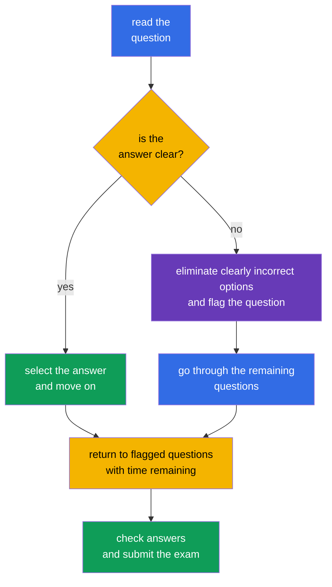

[Русская версия](ru.md) · [Versión en español](es.md) · [Version française](fr.md) · [Deutsche Version](de.md) · [ქართული ვერსია](ge.md) · [繁體中文版](tw.md) · [日本語版](jp.md)

# Chapter 20. KCSA Exam: Strategy, Time Management, and Checklist

> **What's next.** The previous chapters covered the six KCSA domains, from the 4C model and cluster components to supply chain and compliance. This final chapter turns knowledge into a preparation plan for the multiple choice exam. It does not belong to a separate domain and adds no new weight. Course examples target Kubernetes `v1.36`.

## 20.1 Exam format and logistics

KCSA tests conceptual knowledge of cloud native and Kubernetes security. It is an online proctored exam with multiple choice questions, not hands-on command-line work. **Under Linux Foundation rules verified on September 1, 2026, the standard MCQ (multiple choice question) exam has 60 questions, lasts 90 minutes, and requires 75% to pass.**

**Rules snapshot as of 2026-09-01.** The official Linux Foundation language matrix lists English only for KCSA. The LF policy for multiple choice exams prohibits tools, reference materials, and external websites. Practice in the same mode: read the stem and every option in English, recall the term without translation, and eliminate options without documentation, searches, or notes. After a mock, write a Russian explanation of the mistake, but solve the next attempt in English again and with resources closed.

The number of questions, duration, passing score, and other organizational conditions may change after the snapshot date. Before registering, check the current Linux Foundation materials rather than an old blog, a course retelling, or a practice test.

| What to check before registering | Why it matters |
|---|---|
| format, number of questions, and duration | calculate the pace and avoid preparing for hands-on tasks |
| current passing score | set a realistic target result on mocks |
| proctoring requirements | check your ID, camera, microphone, network, and workspace in advance |
| exam rules | avoid violating restrictions on materials, applications, and actions during the session |

Remote proctoring is part of the exam procedure, not a KCSA question. Prepare a quiet place, stable connection, and equipment in advance according to the official instructions. Do not try to compensate for gaps in topic knowledge with external materials: their availability is determined by the rules of the specific session.

## 20.2 MCQ tactics and common traps

First read the entire question, then identify what it asks for: a definition, threat, most direct control, tool, or the boundary of its effect. Options often contain several useful technologies, but the correct one is the option that solves **exactly** the described problem.

A useful sequence:

1. Name the asset and risk: is it a `Secret`, network flow, API access, image, worker node, or runtime behavior.
2. Separate prevention from detection and recovery. For example, admission can prevent an object from being accepted, Falco observes runtime events, and the audit log records Kubernetes API calls.
3. Eliminate answers that apply to a different 4C layer or do not address the question condition.
4. When two options are plausible, choose the most specific and direct one. Do not add assumptions that are not stated in the condition.

| Wording or trap | Correct idea |
|---|---|
| "`Secret` is base64-encoded" | base64 is encoding, not encryption; use RBAC, etcd protection, and, when needed, encryption at rest |
| "Need to see who called the Kubernetes API" | audit logging, not Falco or an image scanner |
| "Need to detect a shell inside a running container" | runtime detection, for example Falco; the audit log does not record every process syscall |
| "Need to prohibit a `privileged` `Pod` before creation" | PSA or an admission policy; RBAC determines the right to create an object, but not all of its fields |
| "Need to limit connections between `Pod`" | `NetworkPolicy`; TLS and mTLS protect an allowed channel but do not themselves define a flow allowlist |

The words **best**, **most appropriate**, **primarily**, and **before creation** usually narrow the answer. The words **not** and **except** require special attention: before choosing an option, rephrase the question positively. Do not spend time looking for a hidden trick when one option directly matches the purpose of the mechanism.

## 20.3 Time management: answer, flag, return

With 60 questions in 90 minutes, the average budget is **1.5 minutes per question**. This is not an obligation to answer every question in exactly 90 seconds: easy questions create a reserve for scenarios, tables, and ambiguous wording.

A practical plan: on the first pass, answer what you know and flag uncertain questions without spending too long on them. On the second pass, return to flagged questions and compare the remaining options with key concepts. In the final minutes, reread questions with negation and make sure the selected option is saved. Do not change an answer merely from anxiety: change it when you find a specific error in your reasoning.

## 20.4 Revision checklist for the six domains

Spend time roughly in proportion to the official weights. A high weight does not mean you should skip the other domains: a question from any of them can determine the final result. If mock results show a weak domain, first analyze errors by concept, then revisit the related chapters.

| Domain and weight | What to distinguish | Course chapters |
|---|---|---|
| Overview of Cloud Native Security - 14% | 4C, shared responsibility, isolation, images, and code | [03](../03/README.md)-[06](../06/README.md) |
| Kubernetes Cluster Component Security - 22% | API Server, etcd, kubelet, runtime, kubeconfig, network, and storage | [07](../07/README.md)-[09](../09/README.md) |
| Kubernetes Security Fundamentals - 22% | authentication, RBAC, PSS/PSA, `Secret`, `NetworkPolicy`, audit levels | [10](../10/README.md)-[14](../14/README.md) |
| Kubernetes Threat Model - 16% | trust boundaries and data flows, persistence, DoS, malicious code / compromised applications, attacker on the network, access to sensitive data, privilege escalation | [15](../15/README.md)-[16](../16/README.md) |
| Platform Security - 16% | SBOM, signatures, registry, admission, observability, PKI, TLS, mTLS, and service mesh | [17](../17/README.md)-[18](../18/README.md) |
| Compliance and Security Frameworks - 10% | compliance frameworks, threat-modelling frameworks (for example, STRIDE), supply-chain compliance, automation, and tooling | [19](../19/README.md) |

A short checklist before the exam:

- explain the difference between authentication, authorization, and admission;
- distinguish `NetworkPolicy`, TLS/mTLS, RBAC, and encryption at rest by the boundary they protect;
- remember that a base64 `Secret` is not encrypted;
- match an audit level to the amount of event data;
- distinguish scanning, signing, an SBOM, and runtime detection;
- name the purpose of PSS/PSA, Falco, Trivy, Prometheus, service mesh, OPA/Gatekeeper, Kyverno, and `ValidatingAdmissionPolicy`.

## 20.5 How to use mock exams

A mock tests not only the number of correct answers but also the quality of your decision-making. Take it in one timed session, without hints, and under conditions close to the permitted exam rules. After finishing, first record the result, then open the answer key and explanations.

Use the [KCSA mock exams](../../mock/README.md) in this cycle:

1. Take a set under a timer and mark questions where the answer was guessed or selected with uncertainty.
2. Analyze every error by its cause: a missing concept, a confused control, an unread negation, or incorrectly allocated time.
3. Return to the domain chapter in the table above and formulate the rule in your own words.
4. Repeat the questions later to test understanding rather than memory of the answer letter.

Do not conclude that you are ready from a single high score. It is better to see consistent results across several attempts and be able to explain why the other three options are wrong. If a mock shows weakness in one domain, do not rewrite all your notes: revisit its definitions, the boundaries of controls, and common contrasts.

## 20.6 How this is used in practice

Exam tactics are useful beyond certification. During an incident or review, an engineer also starts by stating the question precisely: which asset is affected, where is the trust boundary, which control will prevent the risk, which will detect the event, and which data will support the conclusion. This order reduces the temptation to apply a popular tool outside its intended purpose.

A team can maintain a compact review checklist: is the image trusted, are permissions minimal, are the expected network paths present, are secrets protected, are actions observable, and is the owner of an exception known. This does not replace a threat model or policy, but it helps apply them consistently.

## 20.7 Exam vocabulary / Mini-glossary

| Term | Meaning |
|---|---|
| MCQ | multiple choice question |
| proctoring | a supervised exam-taking procedure with observation under the provider's rules |
| mock exam | a practice exam that simulates the format and time constraint |
| distractor | a plausible but incorrect answer option |
| most appropriate | an instruction to select the most direct and suitable answer among those that are semantically acceptable |
| audit level | the level of detail in a Kubernetes audit event, for example `Metadata` or `RequestResponse` |
| runtime detection | detection of process behavior after a workload starts |

## 20.8 Exam Essentials / Chapter summary

- In the 2026-09-01 snapshot, KCSA follows the standard LF MCQ format: 60 questions, 90 minutes, a 75% passing score, and online proctoring.
- The number of questions, duration, passing score, and other organizational conditions must be rechecked in current Linux Foundation materials before the attempt.
- In an MCQ, select the most direct control for the stated asset, threat, and stage: prevention, detection, or investigation.
- Approximately 1.5 minutes per question helps build a plan: answer what is known, flag difficult questions, and return with time remaining.
- Revision across the six domains should account for the 14/22/22/16/16/10 weights and actual errors in mocks.
- A mock is useful when its error causes are analyzed afterward, not merely when correct letters are counted.

## 20.9 Do not confuse these, and how they appear on the exam

KCSA questions test the ability to distinguish similar mechanisms. Read the nouns and verbs in the condition: "prohibit before creation" points to admission, "whether an identity is allowed" points to authorization, "who called the API" points to audit, and "what a process did" points to runtime detection. If the question concerns traffic confidentiality, do not confuse TLS/mTLS with `NetworkPolicy`; if it concerns access to a stored `Secret`, do not confuse base64, RBAC, and encryption at rest.

A question about the exam format may test not memory of a changing number, but understanding of the difference between KCSA and CKS. KCSA is conceptual and uses MCQ, whereas CKS focuses on completing practical tasks. Obtain exact organizational conditions from current official materials, not from an old question bank.

## 20.10 Self-check questions

### 1. Which statement best describes KCSA?

   - a. It is an exam only about configuring a service mesh.

   - b. It is a practical exam where all answers are given through `kubectl`.

   - c. It is an online proctored exam with multiple choice questions that tests conceptual knowledge.

   - d. It tests the skill of writing Rego policies.

Answer and explanation

**Correct answer: c.** KCSA tests conceptual understanding of cloud native and Kubernetes security in MCQ format. Practical command-line tasks are characteristic of performance-based certifications, such as CKS.

### 2. What is the best action for a question where, after reasonably eliminating options, there is still no confident answer?

   - a. Leave the question unanswered and finish the attempt immediately to avoid risking an incorrect choice.

   - b. Choose the best-supported option, flag the question, and return to it after the first pass.

   - c. Change previous answers at the first uncertain question, even if there were confident grounds for them.

   - d. Stop at that question and spend all the remaining time until complete certainty appears.

Answer and explanation

**Correct answer: b.** With limited time, it is useful to maintain the first-pass pace and then return to marked questions. The specific capabilities of the exam interface must be checked before the session.

### 3. A question states: "Which control most directly shows who sent a `delete secrets` request to the Kubernetes API?" What should you choose?

   - a. base64 encoding of a `Secret`.

   - b. Kubernetes audit logging.

   - c. image scanning.

   - d. `NetworkPolicy`.

Answer and explanation

**Correct answer: b.** The audit log records Kubernetes API events and their context, including the initiator when the appropriate audit policy is configured. Image scanning analyzes an artifact, `NetworkPolicy` manages network flows, and base64 is not an auditing mechanism.

> **Where to next.** After KCSA, deepen your administration practice in the CKA course. Linux Foundation requires passing CKA before attempting CKS; the CKS course can be used as supplementary reading, but it does not replace this prerequisite.

**KCSA mock exams:** [Mock Exam 01](../../mock/01/README.md) · [Mock Exam 02](../../mock/02/README.md) - 60 questions each, closed-book, 90 minutes (see §20.5).

[Contents](../README.md) · [Chapter 19](../19/README.md)
