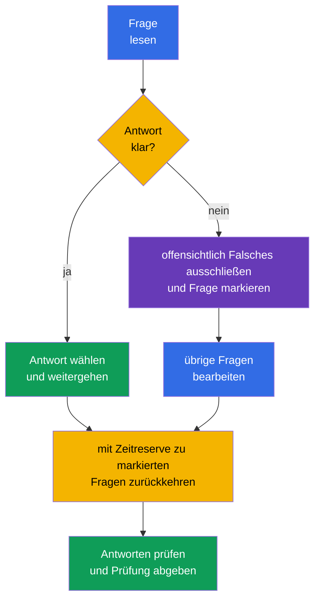

[Русская версия](ru.md) · [Eng version](README.md) · [Versión en español](es.md) · [Version française](fr.md) · [ქართული ვერსია](ge.md) · [繁體中文版](tw.md) · [日本語版](jp.md)

# Kapitel 20. KCSA-Prüfung: Strategie, Zeitmanagement und Checkliste

> **Was kommt als Nächstes.** Die vorherigen Kapitel behandelten die sechs KCSA-Domänen: vom 4C-Modell und den Cluster-Komponenten bis zu Supply Chain und Compliance. Dieses Abschlusskapitel macht aus Wissen einen Vorbereitungsplan für die multiple-choice-Prüfung. Es gehört zu keiner einzelnen Domäne und fügt keine neue Gewichtung hinzu. Die Kursbeispiele orientieren sich an Kubernetes `v1.36`.

## 20.1 Prüfungsformat und Logistik

KCSA prüft das konzeptionelle Verständnis von Cloud Native und Kubernetes Security. Es ist eine online proctored Prüfung mit multiple-choice-Fragen, keine praktische Arbeit in der Kommandozeile. **Nach den am 1. September 2026 überprüften Regeln der Linux Foundation umfasst eine Standard-MCQ-Prüfung (multiple choice question, Frage mit Antwortauswahl) 60 Fragen, dauert 90 Minuten und erfordert 75 % zum Bestehen.**

**Regelstand vom 2026-09-01.** Die offizielle Sprachmatrix der Linux Foundation führt für KCSA nur Englisch auf. Die LF-Richtlinie für multiple-choice-Prüfungen verbietet Tools, Referenzmaterialien und externe Websites. Üben Sie unter denselben Bedingungen: Lesen Sie Frage und alle Optionen auf Englisch, erinnern Sie sich ohne Übersetzung an den Begriff und schließen Sie Optionen ohne Dokumentation, Suche und Notizen aus. Notieren Sie nach einem Mock eine deutsche Erklärung des Fehlers, aber lösen Sie den nächsten Versuch wieder auf Englisch und mit geschlossenen Ressourcen.

Die Zahl der Fragen, die Dauer, die Bestehensgrenze und weitere organisatorische Bedingungen können sich nach dem Stichtag ändern. Prüfen Sie vor der Anmeldung die aktuellen Unterlagen der Linux Foundation erneut, nicht einen alten Blog, eine Kurszusammenfassung oder einen Übungstest.

| Vor der Anmeldung prüfen | Warum es wichtig ist |
|---|---|
| Format, Fragenzahl und Dauer | das Tempo berechnen und sich nicht auf hands-on-Aufgaben vorbereiten |
| aktuelle Bestehensgrenze | ein realistisches Zielergebnis in Mocks festlegen |
| Anforderungen an das Proctoring | Ausweis, Kamera, Mikrofon, Netzwerk und Arbeitsraum frühzeitig prüfen |
| Prüfungsregeln | Einschränkungen für Materialien, Anwendungen und Aktionen während der Sitzung nicht verletzen |

Remote-Proctoring ist Teil des Prüfungsverfahrens, keine KCSA-Frage. Bereiten Sie nach den offiziellen Anweisungen rechtzeitig einen ruhigen Ort, eine stabile Verbindung und die Ausrüstung vor. Versuchen Sie nicht, fehlende Themenkenntnisse durch externe Materialien auszugleichen: Ihre Verfügbarkeit bestimmen die Regeln der jeweiligen Sitzung.

## 20.2 MCQ-Taktik und typische Fallstricke

Lesen Sie zunächst die gesamte Frage und bestimmen Sie dann, wonach sie fragt: eine Definition, eine Bedrohung, die direkteste Kontrolle, ein Tool oder die Grenze seines Wirkungsbereichs. Die Optionen enthalten oft mehrere nützliche Technologien, aber richtig ist diejenige, die **genau** das beschriebene Problem löst.

Eine nützliche Reihenfolge:

1. Benennen Sie Asset und Risiko: Handelt es sich um ein `Secret`, einen Netzwerkfluss, API-Zugriff, ein Image, einen Worker Node oder Runtime-Verhalten.
2. Trennen Sie Prävention von Erkennung und Wiederherstellung. Admission kann beispielsweise ein Objekt verhindern, Falco beobachtet Runtime-Ereignisse und das Audit Log zeichnet Kubernetes-API-Aufrufe auf.
3. Schließen Sie Antworten aus, die zu einer anderen 4C-Schicht gehören oder die Bedingung der Frage nicht beantworten.
4. Wählen Sie bei zwei plausiblen Optionen die spezifischste und direkteste. Ergänzen Sie die Bedingung nicht um nicht genannte Annahmen.

| Formulierung oder Fallstrick | Richtiger Gedanke |
|---|---|
| „`Secret` ist in base64 kodiert“ | base64 ist Kodierung, nicht encryption; erforderlich sind RBAC, Schutz von etcd und bei Bedarf encryption at rest |
| „Es muss erkennbar sein, wer die Kubernetes API aufgerufen hat“ | audit logging, nicht Falco oder ein Image Scanner |
| „Eine Shell in einem laufenden Container muss erkannt werden“ | Runtime Detection, beispielsweise Falco; das Audit Log erfasst nicht alle Syscalls eines Prozesses |
| „Ein `privileged` `Pod` muss vor seiner Erstellung verboten werden“ | PSA oder eine Admission Policy; RBAC bestimmt die Berechtigung zum Erstellen eines Objekts, aber nicht alle seine Felder |
| „Verbindungen zwischen `Pod` müssen eingeschränkt werden“ | `NetworkPolicy`; TLS und mTLS schützen einen erlaubten Kanal, definieren aber selbst keine Allowlist für Flüsse |

Die Wörter **best**, **most appropriate**, **primarily** und **before creation** grenzen die Antwort meist ein. Die Wörter **not** und **except** erfordern besondere Aufmerksamkeit: Formulieren Sie die Frage positiv um, bevor Sie eine Option wählen. Verlieren Sie keine Zeit mit der Suche nach einem versteckten Trick, wenn eine Option dem Zweck eines Mechanismus direkt entspricht.

## 20.3 Zeitmanagement: antworten, markieren, zurückkehren

Bei 60 Fragen in 90 Minuten beträgt das durchschnittliche Budget **1,5 Minuten pro Frage**. Das ist keine Pflicht, exakt nach 90 Sekunden zu antworten: Einfache Fragen schaffen eine Reserve für Szenarien, Tabellen und mehrdeutige Formulierungen.

Ein praktikabler Plan: Beantworten Sie im ersten Durchgang Bekanntes und markieren Sie Zweifelhaftes, ohne zu lange zu verweilen. Kehren Sie im zweiten Durchgang zu den markierten Fragen zurück und vergleichen Sie die verbleibenden Optionen mit den Kernbegriffen. Lesen Sie in den letzten Minuten Fragen mit Verneinungen erneut und stellen Sie sicher, dass die gewählte Option gespeichert ist. Ändern Sie eine Antwort nicht nur aus Angst: Ändern Sie sie, wenn Sie einen konkreten Fehler in Ihrer Überlegung gefunden haben.

## 20.4 Wiederholungscheckliste für die sechs Domänen

Wenden Sie Zeit ungefähr proportional zu den offiziellen Gewichtungen auf. Eine hohe Gewichtung bedeutet nicht, dass andere Domänen übersprungen werden sollten: Eine Frage aus jeder von ihnen kann das Endergebnis entscheiden. Wenn Mock-Ergebnisse eine schwache Domäne zeigen, analysieren Sie zuerst die Fehler nach Konzepten und wiederholen Sie dann die zugehörigen Kapitel.

| Domäne und Gewichtung | Was unterschieden werden muss | Kapitel des Kurses |
|---|---|---|
| Overview of Cloud Native Security - 14% | 4C, shared responsibility, Isolierung, Images und Code | [03](../03/de.md)-[06](../06/de.md) |
| Kubernetes Cluster Component Security - 22% | API Server, etcd, kubelet, Runtime, kubeconfig, Netzwerk und Storage | [07](../07/de.md)-[09](../09/de.md) |
| Kubernetes Security Fundamentals - 22% | authentication, RBAC, PSS/PSA, `Secret`, `NetworkPolicy`, Audit Levels | [10](../10/de.md)-[14](../14/de.md) |
| Kubernetes Threat Model - 16% | Trust Boundaries und Data Flows, Persistence, DoS, malicious code / compromised applications, attacker on the network, access to sensitive data, privilege escalation | [15](../15/de.md)-[16](../16/de.md) |
| Platform Security - 16% | SBOM, Signaturen, Registry, Admission, Observability, PKI, TLS, mTLS und Service Mesh | [17](../17/de.md)-[18](../18/de.md) |
| Compliance and Security Frameworks - 10% | Compliance Frameworks, Threat-Modelling-Frameworks (beispielsweise STRIDE), Supply-Chain-Compliance, Automatisierung und Tooling | [19](../19/de.md) |

Kurze Checkliste vor der Prüfung:

- den Unterschied zwischen authentication, authorization und admission erklären;
- `NetworkPolicy`, TLS/mTLS, RBAC und encryption at rest nach der geschützten Grenze unterscheiden;
- beachten, dass ein `Secret` in base64 nicht verschlüsselt ist;
- ein Audit Level dem Umfang der Ereignisdaten zuordnen;
- Scan, Signatur, SBOM und Runtime Detection unterscheiden;
- den Zweck von PSS/PSA, Falco, Trivy, Prometheus, Service Mesh, OPA/Gatekeeper, Kyverno und `ValidatingAdmissionPolicy` benennen.

## 20.5 Wie Mock-Prüfungen genutzt werden

Ein Mock prüft nicht nur die Zahl richtiger Antworten, sondern auch die Qualität der Entscheidung. Absolvieren Sie ihn in einer Sitzung mit Timer, ohne Hinweise und unter Bedingungen, die den erlaubten Prüfungsregeln nahekommen. Halten Sie nach Abschluss zunächst das Ergebnis fest und öffnen Sie erst dann Lösungen und Erläuterungen.

Nutzen Sie die [KCSA-Mock-Prüfungen](../../mock/README.md) in diesem Zyklus:

1. Einen Satz mit Timer absolvieren und Fragen markieren, bei denen die Antwort geraten oder mit Unsicherheit gewählt wurde.
2. Jeden Fehler nach seiner Ursache analysieren: Ein Konzept fehlte, eine Kontrolle wurde verwechselt, eine Verneinung wurde nicht gelesen oder die Zeit wurde falsch eingeteilt.
3. Zum Kapitel der Domäne aus der obigen Tabelle zurückkehren und die Regel mit eigenen Worten formulieren.
4. Die Fragen nach einiger Zeit wiederholen, um das Verständnis und nicht die Erinnerung an den Antwortbuchstaben zu prüfen.

Leiten Sie die Bereitschaft nicht nur aus einem einzigen hohen Ergebnis ab. Besser ist ein stabiles Ergebnis in mehreren Versuchen und die Fähigkeit zu erklären, warum die drei anderen Optionen falsch sind. Wenn ein Mock eine Schwäche in einer Domäne zeigt, schreiben Sie nicht die gesamte Zusammenfassung neu: Wiederholen Sie deren Definitionen, die Wirkungsgrenzen von Kontrollen und typische Kontraste.

## 20.6 Wie dies in der Praxis angewendet wird

Prüfungstaktik ist auch außerhalb einer Zertifizierung nützlich. Bei einem Incident oder Review beginnt ein Engineer ebenfalls mit einer präzisen Fragestellung: Welches Asset ist betroffen, wo liegt die Vertrauensgrenze, welche Kontrolle verhindert das Risiko, welche erkennt das Ereignis und welche Daten bestätigen die Schlussfolgerung. Diese Reihenfolge reduziert die Versuchung, ein beliebtes Tool außerhalb seines Zwecks einzusetzen.

Ein Team kann eine kompakte Checkliste für ein Review pflegen: Ist das Image vertrauenswürdig, sind die Berechtigungen minimal, gibt es erwartete Netzwerkpfade, sind Secrets geschützt, sind Aktionen beobachtbar und ist der Eigentümer einer Ausnahme bekannt. Das ersetzt kein Threat Model oder keine Policy, hilft aber bei ihrer konsequenten Anwendung.

## 20.7 Exam vocabulary / Mini-Glossar

| Begriff | Bedeutung |
|---|---|
| MCQ | multiple choice question, Frage mit Antwortauswahl |
| proctoring | überwachtes Prüfungsverfahren mit Beobachtung nach den Regeln des Anbieters |
| mock exam | Übungsprüfung, die Format und Zeitlimit nachbildet |
| distractor | plausible, aber falsche Antwortoption |
| most appropriate | Hinweis, unter den inhaltlich zulässigen Antworten die direkteste und passendste zu wählen |
| audit level | Detailgrad eines Kubernetes-Audit-Ereignisses, beispielsweise `Metadata` oder `RequestResponse` |
| runtime detection | Erkennung des Prozessverhaltens nach dem Start eines Workloads |

## 20.8 Exam Essentials / Zusammenfassung des Kapitels

- Beim Stand vom 2026-09-01 folgt KCSA dem LF-Standard-MCQ-Format: 60 Fragen, 90 Minuten, Bestehensgrenze 75 %; die Prüfung findet online mit Proctoring statt.
- Fragenzahl, Dauer, Bestehensgrenze und weitere organisatorische Bedingungen müssen vor dem Versuch in aktuellen Unterlagen der Linux Foundation erneut geprüft werden.
- Bei MCQs wird die direkteste Kontrolle für das angegebene Asset, die Bedrohung und die Phase gewählt: Prävention, Erkennung oder Untersuchung.
- Etwa 1,5 Minuten pro Frage helfen beim Aufbau eines Plans: Bekanntes beantworten, Schwieriges markieren, mit Reserve zurückkehren.
- Die Wiederholung über die sechs Domänen sollte die Gewichtungen 14/22/22/16/16/10 und die tatsächlichen Fehler in Mocks berücksichtigen.
- Ein Mock ist nützlich, wenn danach die Fehlerursachen analysiert werden, nicht nur die richtigen Buchstaben gezählt werden.

## 20.9 Nicht verwechseln und wie es in der Prüfung vorkommt

KCSA-Fragen prüfen die Unterscheidung ähnlicher Mechanismen. Lesen Sie die Substantive und Verben der Bedingung: „vor der Erstellung verbieten“ weist auf Admission hin, „ist die Identity berechtigt“ auf Authorization, „wer hat die API aufgerufen“ auf Audit, „was hat der Prozess getan“ auf Runtime Detection. Wenn die Frage die Vertraulichkeit des Verkehrs betrifft, verwechseln Sie TLS/mTLS nicht mit `NetworkPolicy`; wenn sie den Zugriff auf ein gespeichertes `Secret` betrifft, verwechseln Sie base64, RBAC und encryption at rest nicht.

Eine Frage zum Prüfungsformat kann nicht das Erinnern einer veränderlichen Zahl prüfen, sondern das Verständnis des Unterschieds zwischen KCSA und CKS. KCSA ist konzeptionell und verwendet MCQs, während CKS auf die Ausführung praktischer Aufgaben ausgerichtet ist. Entnehmen Sie die genauen organisatorischen Bedingungen aktuellen offiziellen Unterlagen, nicht einem alten Fragenkatalog.

## 20.10 Fragen zur Selbstkontrolle

### 1. Welche Aussage beschreibt KCSA am besten?

   - a. Es ist eine Prüfung nur zur Konfiguration eines Service Mesh.

   - b. Es ist eine praktische Prüfung, bei der alle Antworten über `kubectl` gegeben werden.

   - c. Es ist eine online proctored Prüfung mit multiple-choice-Fragen, die konzeptionelles Wissen prüft.

   - d. Es ist eine Prüfung der Fähigkeit, Rego-Policies zu schreiben.

Antwort und Erklärung

**Richtige Antwort: c.** KCSA prüft das konzeptionelle Verständnis von Cloud Native und Kubernetes Security im MCQ-Format. Praktische Aufgaben in der Kommandozeile sind typisch für performance-based Zertifizierungen wie CKS.

### 2. Wie sollte bei einer Frage vorgegangen werden, auf die nach vernünftigem Ausschließen von Optionen weiterhin keine sichere Antwort bekannt ist?

   - a. Die Frage unbeantwortet lassen und den Versuch sofort beenden, um keine falsche Auswahl zu riskieren.

   - b. Die am besten begründete Option wählen, die Frage markieren und nach dem ersten Durchgang zu ihr zurückkehren.

   - c. Bei der ersten zweifelhaften Frage vorherige Antworten ändern, selbst wenn es für sie sichere Gründe gab.

   - d. Bei dieser Frage stehen bleiben und die gesamte verbleibende Zeit aufwenden, bis vollständige Sicherheit besteht.

Antwort und Erklärung

**Richtige Antwort: b.** Bei begrenzter Zeit ist es nützlich, das Tempo des ersten Durchgangs beizubehalten und dann zu markierten Fragen zurückzukehren. Die konkreten Möglichkeiten der Prüfungsoberfläche müssen vor der Sitzung geprüft werden.

### 3. In einer Frage heißt es: „Welche Kontrolle zeigt am direktesten, wer eine `delete secrets`-Anfrage an die Kubernetes API gesendet hat?“ Was ist zu wählen?

   - a. base64-Kodierung eines `Secret`.

   - b. Kubernetes audit logging.

   - c. Image Scan.

   - d. `NetworkPolicy`.

Antwort und Erklärung

**Richtige Antwort: b.** Das Audit Log zeichnet Kubernetes-API-Ereignisse und deren Kontext auf, einschließlich des Initiators bei entsprechender Audit Policy. Ein Image Scan analysiert ein Artefakt, `NetworkPolicy` steuert Netzwerkflüsse und base64 ist kein Audit-Mechanismus.

> **Wohin als Nächstes.** Vertiefen Sie nach KCSA die administrative Praxis im CKA-Kurs. Die Linux Foundation verlangt einen bestandenen CKA vor dem Versuch von CKS; der CKS-Kurs kann als zusätzliche Lektüre dienen, ersetzt diese prerequisite aber nicht.

**KCSA-Mock-Prüfungen:** [Mock Exam 01](../../mock/01/README.md) · [Mock Exam 02](../../mock/02/README.md) - jeweils 60 Fragen, closed-book, 90 Minuten (siehe §20.5).

[Inhaltsverzeichnis](../README_DE.md) · [Kapitel 19](../19/de.md)
