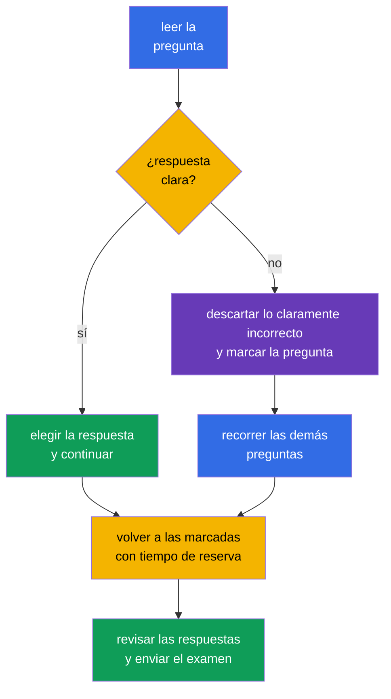

[Русская версия](ru.md) · [Eng version](README.md) · [Version française](fr.md) · [Deutsche Version](de.md) · [ქართული ვერსია](ge.md) · [繁體中文版](tw.md) · [日本語版](jp.md)

# Capítulo 20. Examen KCSA: estrategia, gestión del tiempo y lista de verificación

> **Qué sigue.** Los capítulos anteriores analizaron los seis dominios de KCSA: desde el modelo 4C y los componentes del clúster hasta la supply chain y el compliance. Este capítulo final convierte el conocimiento en un plan de preparación para un examen de multiple choice. No pertenece a un dominio específico ni añade una ponderación nueva. Los ejemplos del curso están orientados a Kubernetes `v1.36`.

## 20.1 Formato y logística del examen

KCSA evalúa la comprensión conceptual de la seguridad cloud native y Kubernetes. Es un examen online proctored con preguntas multiple choice, no una tarea práctica en la línea de comandos. **Según las reglas de Linux Foundation, verificadas el 1 de septiembre de 2026, el examen MCQ estándar (multiple choice question, pregunta de opción múltiple) contiene 60 preguntas, dura 90 minutos y requiere un 75% para aprobar.**

**Instantánea de reglas del 2026-09-01.** La matriz oficial de idiomas de Linux Foundation indica solo inglés para KCSA. La política de LF para exámenes multiple choice prohíbe herramientas, materiales de referencia y sitios web externos. Practique en el mismo modo: lea el stem y todas las opciones en inglés, recuerde el término sin traducir y descarte opciones sin documentación, búsqueda ni notas. Tras el mock, anote una explicación en español del error, pero resuelva el siguiente intento de nuevo en inglés y con los recursos cerrados.

El número de preguntas, la duración, la puntuación de aprobación y las demás condiciones organizativas pueden cambiar después de la fecha de la instantánea. Antes de registrarse, vuelva a comprobar los materiales actuales de Linux Foundation, no un blog antiguo, una explicación del curso o una prueba de práctica.

| Qué comprobar antes de registrarse | Por qué es necesario |
|---|---|
| formato, número de preguntas y duración | calcular el ritmo y no prepararse para tareas hands-on |
| puntuación de aprobación actual | establecer un resultado objetivo realista en los mocks |
| requisitos de proctoring | comprobar previamente el documento, la cámara, el micrófono, la red y el espacio de trabajo |
| reglas del examen | no infringir las restricciones sobre materiales, aplicaciones y acciones durante la sesión |

El proctoring remoto es parte del procedimiento del examen, no una pregunta de KCSA. Prepare de antemano un lugar tranquilo, una conexión estable y el equipo de acuerdo con las instrucciones oficiales. No intente compensar el desconocimiento de los temas con materiales externos: su disponibilidad la determinan las reglas de la sesión concreta.

## 20.2 Táctica de MCQ y trampas habituales

Primero lea la pregunta completa y después identifique qué solicita: una definición, una amenaza, el control más directo, una herramienta o el límite de su acción. Las opciones contienen a menudo varias tecnologías útiles, pero será correcta la que resuelva **precisamente** el problema descrito.

Secuencia útil:

1. Nombre el activo y el riesgo: ¿es un `Secret`, un flujo de red, acceso a API, una imagen, un nodo worker o comportamiento de runtime?
2. Separe prevención de detección y recuperación. Por ejemplo, admission puede impedir un objeto, Falco observa eventos de runtime y audit log registra las llamadas a Kubernetes API.
3. Descarte las respuestas que pertenezcan a otra capa de 4C o que no respondan a la condición de la pregunta.
4. Ante dos opciones plausibles, elija la más específica y directa. No añada a la condición supuestos que no se indicaron.

| Formulación o trampa | Idea correcta |
|---|---|
| «`Secret` está codificado en base64» | base64 es codificación, no encryption; se necesitan RBAC, protección de etcd y, si es necesario, encryption at rest |
| «Hay que ver quién llamó a Kubernetes API» | audit logging, no Falco ni image scanner |
| «Hay que detectar una shell dentro de un contenedor en ejecución» | runtime detection, por ejemplo Falco; audit log no registra todos los syscall de un proceso |
| «Hay que prohibir un `privileged` `Pod` antes de crearlo» | PSA o admission policy; RBAC determina el derecho a crear un objeto, pero no todos sus campos |
| «Hay que limitar las conexiones entre `Pod`» | `NetworkPolicy`; TLS y mTLS protegen un canal permitido, pero no definen por sí mismos una allowlist de flujos |

Las palabras **best**, **most appropriate**, **primarily** y **before creation** suelen acotar la respuesta. Las palabras **no** y **excepto** requieren atención especial: antes de elegir una opción, reformule la pregunta en positivo. No pierda tiempo buscando una trampa oculta cuando una opción corresponde directamente al propósito del mecanismo.

## 20.3 Gestión del tiempo: responder, marcar, volver

Con 60 preguntas en 90 minutos, el presupuesto medio es de **1,5 minutos por pregunta**. No es la obligación de responder exactamente en 90 segundos: las preguntas sencillas crean una reserva para escenarios, tablas y formulaciones ambiguas.

Un plan práctico: en la primera pasada responda lo conocido y marque lo dudoso, sin detenerse demasiado. En la segunda pasada vuelva a las preguntas marcadas y compare las opciones restantes con los conceptos clave. En los últimos minutos relea las preguntas con negación y asegúrese de que la opción elegida se haya guardado. No cambie una respuesta solo por ansiedad: cámbiela cuando encuentre un error concreto en el razonamiento.

## 20.4 Lista de verificación de repaso por los seis dominios

Dedique tiempo aproximadamente en proporción a las ponderaciones oficiales. Una ponderación alta no significa que deba omitir los demás dominios: una pregunta de cualquiera de ellos puede decidir el resultado final. Si los resultados de un mock muestran un dominio débil, primero analice los errores por conceptos y después repase los capítulos relacionados.

| Dominio y ponderación | Qué debe distinguir | Capítulos del curso |
|---|---|---|
| Overview of Cloud Native Security - 14% | 4C, shared responsibility, aislamiento, imágenes y código | [03](../03/es.md)-[06](../06/es.md) |
| Kubernetes Cluster Component Security - 22% | API Server, etcd, kubelet, runtime, kubeconfig, red y storage | [07](../07/es.md)-[09](../09/es.md) |
| Kubernetes Security Fundamentals - 22% | authentication, RBAC, PSS/PSA, `Secret`, `NetworkPolicy`, audit levels | [10](../10/es.md)-[14](../14/es.md) |
| Kubernetes Threat Model - 16% | trust boundaries y data flows, persistence, DoS, malicious code / compromised applications, attacker on the network, access to sensitive data, privilege escalation | [15](../15/es.md)-[16](../16/es.md) |
| Platform Security - 16% | SBOM, firmas, registry, admission, observability, PKI, TLS, mTLS y service mesh | [17](../17/es.md)-[18](../18/es.md) |
| Compliance and Security Frameworks - 10% | compliance frameworks, threat-modelling frameworks (por ejemplo, STRIDE), supply-chain compliance, automation y tooling | [19](../19/es.md) |

Lista de verificación breve antes del examen:

- explicar la diferencia entre authentication, authorization y admission;
- distinguir `NetworkPolicy`, TLS/mTLS, RBAC y encryption at rest según el límite que protegen;
- recordar que `Secret` en base64 no está cifrado;
- relacionar audit level con el volumen de datos del evento;
- distinguir scan, firma, SBOM y runtime detection;
- indicar el propósito de PSS/PSA, Falco, Trivy, Prometheus, service mesh, OPA/Gatekeeper, Kyverno y `ValidatingAdmissionPolicy`.

## 20.5 Cómo usar los mock exams

Un mock no solo evalúa el número de respuestas correctas, sino también la calidad de la resolución. Realícelo en una sola sesión con temporizador, sin pistas y en condiciones cercanas a las reglas permitidas para el examen. Tras terminar, primero registre el resultado y luego abra las claves y explicaciones.

Use los [mock exams de KCSA](../../mock/README.md) en este ciclo:

1. Realice el conjunto con temporizador y marque las preguntas cuya respuesta se adivinó o se eligió con dudas.
2. Analice cada error por su causa: faltó un concepto, se confundió un control, no se leyó una negación o se distribuyó mal el tiempo.
3. Vuelva al capítulo del dominio de la tabla anterior y formule la regla con sus propias palabras.
4. Repita las preguntas tras un tiempo para comprobar la comprensión, no la memoria de la letra de la respuesta.

No concluya que está preparado basándose solo en un resultado alto. Es mejor observar resultados estables en varios intentos y poder explicar por qué las otras tres opciones son incorrectas. Si el mock muestra debilidad en un dominio, no reescriba todos los apuntes: repase sus definiciones, los límites de acción de los controles y los contrastes habituales.

## 20.6 Cómo se aplica en la práctica

La táctica de examen también es útil fuera de la certificación. Ante un incidente o review, el ingeniero empieza igualmente con una formulación precisa de la pregunta: qué activo está afectado, dónde está el límite de confianza, qué control prevendrá el riesgo, cuál detectará el evento y qué datos confirmarán la conclusión. Este orden reduce la tentación de aplicar una herramienta popular fuera de su propósito.

Un equipo puede mantener una lista de verificación compacta para un review: si la imagen es de confianza, si los privilegios son mínimos, si existen las rutas de red esperadas, si los secretos están protegidos, si las acciones son observables y si se conoce el propietario de la excepción. No sustituye un threat model o una policy, pero ayuda a aplicarlos de forma consistente.

## 20.7 Exam vocabulary / Miniglosario

| Término | Significado |
|---|---|
| MCQ | multiple choice question, pregunta de opción múltiple |
| proctoring | procedimiento supervisado de realización del examen con observación conforme a las reglas del proveedor |
| mock exam | examen de práctica que simula el formato y el límite de tiempo |
| distractor | opción de respuesta plausible pero incorrecta |
| most appropriate | indicación de elegir la respuesta más directa y adecuada entre las aceptables por significado |
| audit level | nivel de detalle de un evento de Kubernetes audit, por ejemplo `Metadata` o `RequestResponse` |
| runtime detection | detección del comportamiento de un proceso después de iniciar el workload |

## 20.8 Exam Essentials / Resumen del capítulo

- En la instantánea de 2026-09-01, KCSA sigue el formato estándar de LF MCQ: 60 preguntas, 90 minutos, puntuación de aprobación del 75%; el examen se realiza online con proctoring.
- El número de preguntas, la duración, la puntuación de aprobación y las demás condiciones organizativas deben volver a comprobarse en los materiales actuales de Linux Foundation antes del intento.
- En MCQ se elige el control más directo para el activo, la amenaza y la fase indicados: prevención, detección o investigación.
- Aproximadamente 1,5 minutos por pregunta ayudan a construir un plan: responder lo conocido, marcar lo difícil y volver con una reserva.
- El repaso de los seis dominios debe considerar las ponderaciones 14/22/22/16/16/10 y los errores reales en los mocks.
- El mock es útil cuando se analizan después las causas de los errores, no solo se cuentan las letras correctas.

## 20.9 No confundir y cómo aparece en el examen

Las preguntas de KCSA evalúan la distinción entre mecanismos similares. Lea los sustantivos y verbos de la condición: «prohibir antes de crear» lleva a admission, «si una identity está permitida» a authorization, «quién llamó a API» a audit, «qué hizo el proceso» a runtime detection. Si la pregunta es sobre la confidencialidad del tráfico, no confunda TLS/mTLS con `NetworkPolicy`; si trata sobre el acceso a un `Secret` almacenado, no confunda base64, RBAC y encryption at rest.

Una pregunta sobre el formato del examen puede evaluar no la memoria de una cifra variable, sino la comprensión de la diferencia entre KCSA y CKS. KCSA es conceptual y usa MCQ, mientras que CKS se orienta a realizar tareas prácticas. Obtenga las condiciones organizativas exactas de los materiales oficiales actuales, no de un banco de preguntas antiguo.

## 20.10 Preguntas de autoevaluación

### 1. ¿Qué afirmación describe mejor KCSA?

   - a. Es un examen solo sobre la configuración de service mesh.

   - b. Es un examen práctico donde todas las respuestas se dan mediante `kubectl`.

   - c. Es un examen online proctored con preguntas multiple choice que evalúa conocimientos conceptuales.

   - d. Es una evaluación de habilidades para escribir policies de Rego.

Respuesta y explicación

**Respuesta correcta: c.** KCSA evalúa la comprensión conceptual de la seguridad cloud native y Kubernetes en formato MCQ. Las tareas prácticas en la línea de comandos son características de certificaciones performance-based, como CKS.

### 2. ¿Cuál es la mejor manera de proceder con una pregunta que, después de descartar razonablemente opciones, sigue sin tener una respuesta segura?

   - a. Dejar la pregunta sin responder y terminar el intento de inmediato para no arriesgar una elección incorrecta.

   - b. Elegir la opción con mayor fundamento, marcar la pregunta y volver a ella después de la primera pasada.

   - c. Cambiar las respuestas anteriores ante la primera pregunta dudosa, incluso si había razones seguras para ellas.

   - d. Detenerse en esta pregunta y gastar todo el tiempo restante hasta tener completa seguridad.

Respuesta y explicación

**Respuesta correcta: b.** Con tiempo limitado resulta útil mantener el ritmo de la primera pasada y luego volver a las preguntas marcadas. Las capacidades específicas de la interfaz del examen deben comprobarse antes de la sesión.

### 3. Una pregunta dice: «¿Qué control muestra de la forma más directa quién envió la solicitud `delete secrets` a Kubernetes API?» ¿Qué se debe elegir?

   - a. Codificación base64 de `Secret`.

   - b. Kubernetes audit logging.

   - c. Image scan.

   - d. `NetworkPolicy`.

Respuesta y explicación

**Respuesta correcta: b.** Audit log registra los eventos de Kubernetes API y su contexto, incluido el iniciador con la audit policy correspondiente. Image scan analiza el artefacto, `NetworkPolicy` gestiona los flujos de red y base64 no es un mecanismo de auditoría.

> **Adónde seguir.** Después de KCSA, profundice en la práctica administrativa en el curso CKA. Linux Foundation exige aprobar CKA antes de intentar CKS; el curso CKS puede usarse como lectura adicional, pero no sustituye este prerequisite.

**Mock exams de KCSA:** [Mock Exam 01](../../mock/01/README.md) · [Mock Exam 02](../../mock/02/README.md) - 60 preguntas cada uno, closed-book, 90 minutos (véase §20.5).

[Índice](../README_ES.md) · [Capítulo 19](../19/es.md)
