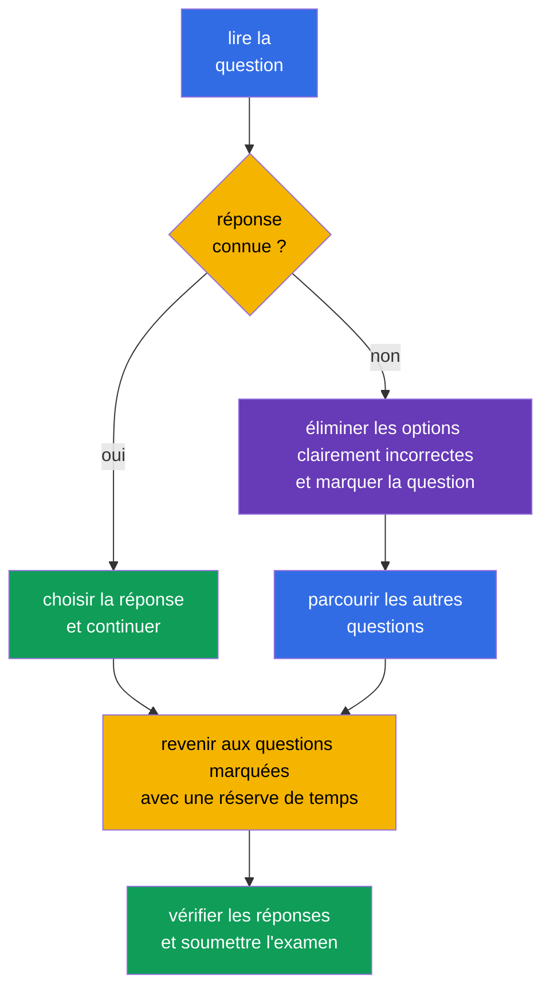

[Русская версия](ru.md) · [Eng version](README.md) · [Versión en español](es.md) · [Deutsche Version](de.md) · [ქართული ვერსია](ge.md) · [繁體中文版](tw.md) · [日本語版](jp.md)

# Chapitre 20. Examen KCSA : stratégie, gestion du temps et checklist

> **La suite.** Les chapitres précédents ont couvert les six domaines du KCSA : du modèle 4C et des composants du cluster jusqu'à la supply chain et la conformité. Ce chapitre final transforme les connaissances en plan de préparation à l'examen à choix multiples. Il ne se rattache à aucun domaine distinct et n'ajoute aucun nouveau poids. Les exemples du cours sont orientés vers Kubernetes `v1.36`.

## 20.1 Format et logistique de l'examen

Le KCSA évalue la compréhension conceptuelle de la sécurité cloud native et Kubernetes. Il s'agit d'un examen online proctored avec des questions multiple choice, et non d'un travail pratique en ligne de commande. **Selon les règles de la Linux Foundation vérifiées le 1er septembre 2026, l'examen MCQ standard (multiple choice question, question à choix multiples) comporte 60 questions, dure 90 minutes et requiert 75 % pour réussir.**

**Instantané des règles au 2026-09-01.** La matrice officielle des langues de la Linux Foundation n'indique que l'anglais pour le KCSA. La politique LF relative aux examens multiple choice interdit les outils, les documents de référence et les sites externes. Entraînez-vous dans le même mode : lisez le stem et toutes les options en anglais, rappelez-vous le terme sans traduction, éliminez les options sans documentation, recherche ni notes. Après un mock, notez une explication française de l'erreur, mais résolvez à nouveau la tentative suivante en anglais et avec les ressources fermées.

Le nombre de questions, la durée, le score de réussite et les autres conditions organisationnelles peuvent changer après la date de l'instantané. Avant l'inscription, vérifiez à nouveau les documents actuels de la Linux Foundation, et non un ancien blog, un résumé du cours ou un test d'entraînement.

| Ce qu'il faut vérifier avant l'inscription | Pourquoi c'est nécessaire |
|---|---|
| format, nombre de questions et durée | calculer le rythme et ne pas se préparer à des tâches hands-on |
| score de réussite actuel | fixer un objectif réaliste pour les résultats aux mocks |
| exigences de proctoring | vérifier à l'avance la pièce d'identité, la caméra, le microphone, le réseau et l'espace de travail |
| règles de l'examen | ne pas enfreindre les restrictions sur les documents, applications et actions pendant la session |

Le proctoring à distance fait partie de la procédure d'examen, et non d'une question KCSA. Préparez à l'avance un endroit calme, une connexion stable et l'équipement conformément aux instructions officielles. N'essayez pas de compenser une méconnaissance des sujets par des ressources externes : leur disponibilité est déterminée par les règles de la session concernée.

## 20.2 Tactique MCQ et pièges courants

Lisez d'abord entièrement la question, puis déterminez ce qu'elle demande : une définition, une menace, le contrôle le plus direct, un outil ou la limite de son action. Les options contiennent souvent plusieurs technologies utiles, mais la bonne réponse est celle qui résout **précisément** le problème décrit.

Séquence utile :

1. Nommez l'actif et le risque : s'agit-il d'un `Secret`, d'un flux réseau, d'un accès API, d'une image, d'un nœud de travail ou d'un comportement runtime.
2. Distinguez la prévention de la détection et de la récupération. Par exemple, l'admission peut empêcher un objet, Falco observe les événements runtime, tandis que l'audit log enregistre les appels de l'API Kubernetes.
3. Éliminez les réponses qui relèvent d'une autre couche 4C ou ne répondent pas à la condition de la question.
4. Entre deux options plausibles, choisissez la plus spécifique et la plus directe. N'ajoutez pas à la condition des hypothèses non indiquées.

| Formulation ou piège | Raisonnement correct |
|---|---|
| « Le `Secret` est encodé en base64 » | base64 est un encodage, pas du encryption ; RBAC, la protection d'etcd et, si nécessaire, encryption at rest sont requis |
| « Il faut voir qui a appelé l'API Kubernetes » | audit logging, et non Falco ou un image scanner |
| « Il faut détecter un shell dans un conteneur en cours d'exécution » | runtime detection, par exemple Falco ; audit log n'enregistre pas tous les syscall du processus |
| « Il faut interdire un `Pod` `privileged` avant sa création » | PSA ou admission policy ; RBAC détermine le droit de créer un objet, mais pas tous ses champs |
| « Il faut limiter les connexions entre les `Pod` » | `NetworkPolicy` ; TLS et mTLS protègent le canal autorisé, mais ne définissent pas eux-mêmes une allowlist de flux |

Les mots **best**, **most appropriate**, **primarily** et **before creation** restreignent généralement la réponse. Les mots **ne pas** et **sauf** demandent une attention particulière : avant de choisir une option, reformulez la question positivement. Ne perdez pas de temps à chercher un piège caché lorsqu'une option correspond directement au rôle du mécanisme.

## 20.3 Gestion du temps : répondre, marquer, revenir

Avec 60 questions en 90 minutes, le budget moyen est de **1,5 minute par question**. Cela n'impose pas de répondre exactement en 90 secondes : les questions simples créent une réserve pour les scénarios, les tableaux et les formulations ambiguës.

Plan pratique : au premier passage, répondez à ce que vous connaissez et marquez ce qui est incertain, sans vous y attarder trop longtemps. Au deuxième passage, revenez aux questions marquées et comparez les options restantes aux concepts clés. Durant les dernières minutes, relisez les questions contenant une négation et assurez-vous que l'option choisie est enregistrée. Ne modifiez pas une réponse uniquement par anxiété : modifiez-la lorsque vous avez identifié une erreur concrète dans le raisonnement.

## 20.4 Checklist de révision selon les six domaines

Consacrez du temps approximativement en proportion des poids officiels. Un poids élevé ne signifie pas qu'il faut ignorer les autres domaines : une question de n'importe lequel d'entre eux peut déterminer le résultat final. Si les résultats d'un mock révèlent un domaine faible, analysez d'abord les erreurs par concept, puis révisez les chapitres associés.

| Domaine et poids | Ce qu'il faut savoir distinguer | Chapitres du cours |
|---|---|---|
| Overview of Cloud Native Security - 14% | 4C, shared responsibility, isolation, images et code | [03](../03/fr.md)-[06](../06/fr.md) |
| Kubernetes Cluster Component Security - 22% | API Server, etcd, kubelet, runtime, kubeconfig, réseau et storage | [07](../07/fr.md)-[09](../09/fr.md) |
| Kubernetes Security Fundamentals - 22% | authentication, RBAC, PSS/PSA, `Secret`, `NetworkPolicy`, audit levels | [10](../10/fr.md)-[14](../14/fr.md) |
| Kubernetes Threat Model - 16% | trust boundaries et data flows, persistence, DoS, malicious code / compromised applications, attacker on the network, access to sensitive data, privilege escalation | [15](../15/fr.md)-[16](../16/fr.md) |
| Platform Security - 16% | SBOM, signatures, registry, admission, observability, PKI, TLS, mTLS et service mesh | [17](../17/fr.md)-[18](../18/fr.md) |
| Compliance and Security Frameworks - 10% | compliance frameworks, threat-modelling frameworks (par exemple STRIDE), supply-chain compliance, automation et tooling | [19](../19/fr.md) |

Checklist courte avant l'examen :

- expliquer la différence entre authentication, authorization et admission ;
- distinguer `NetworkPolicy`, TLS/mTLS, RBAC et encryption at rest selon la limite protégée ;
- retenir qu'un `Secret` en base64 n'est pas chiffré ;
- associer audit level au volume de données de l'événement ;
- distinguer scan, signature, SBOM et runtime detection ;
- nommer le rôle de PSS/PSA, Falco, Trivy, Prometheus, service mesh, OPA/Gatekeeper, Kyverno et `ValidatingAdmissionPolicy`.

## 20.5 Comment utiliser les mock exams

Un mock ne vérifie pas seulement le nombre de réponses correctes, mais aussi la qualité du raisonnement. Passez-le en une seule session avec un minuteur, sans aide et dans des conditions proches des règles autorisées de l'examen. Après l'avoir terminé, consignez d'abord le résultat, puis ouvrez les corrigés et explications.

Utilisez les [mock exams KCSA](../../mock/README.md) selon ce cycle :

1. Passer une série avec un minuteur et marquer les questions dont la réponse a été devinée ou choisie avec hésitation.
2. Analyser chaque erreur par sa cause : concept manquant, contrôle confondu, négation non lue ou temps mal réparti.
3. Revenir au chapitre du domaine figurant dans le tableau ci-dessus et formuler la règle avec ses propres mots.
4. Repasser les questions plus tard pour vérifier la compréhension, et non la mémoire de la lettre de réponse.

Ne concluez pas à l'état de préparation sur la seule base d'un bon résultat. Il vaut mieux observer un résultat stable sur plusieurs tentatives et savoir expliquer pourquoi les trois autres options sont incorrectes. Si un mock révèle une faiblesse dans un domaine, ne réécrivez pas toutes vos notes : révisez ses définitions, les limites d'action des contrôles et les contrastes typiques.

## 20.6 Comment cela s'applique en pratique

La tactique d'examen est également utile hors certification. Lors d'un incident ou d'une review, l'ingénieur commence aussi par poser la question avec précision : quel actif est touché, où se trouve la limite de confiance, quel contrôle préviendra le risque, lequel détectera l'événement et quelles données confirmeront la conclusion. Cet ordre réduit la tentation d'utiliser un outil populaire hors de son rôle.

L'équipe peut maintenir une checklist compacte pour les review : l'image est-elle fiable, les droits sont-ils minimaux, les chemins réseau attendus existent-ils, les secrets sont-ils protégés, les actions sont-elles observables et le propriétaire de l'exception est-il connu. Cela ne remplace pas un threat model ou une policy, mais aide à les appliquer de manière cohérente.

## 20.7 Exam vocabulary / Mini-glossaire

| Terme | Signification |
|---|---|
| MCQ | multiple choice question, question à choix multiples |
| proctoring | procédure contrôlée de passage d'examen avec surveillance selon les règles du fournisseur |
| mock exam | examen d'entraînement simulant le format et la limite de temps |
| distractor | option de réponse plausible mais incorrecte |
| most appropriate | indication de choisir la réponse la plus directe et la plus adaptée parmi celles qui sont sémantiquement acceptables |
| audit level | niveau de détail d'un événement Kubernetes audit, par exemple `Metadata` ou `RequestResponse` |
| runtime detection | détection du comportement d'un processus après le lancement de la charge de travail |

## 20.8 Exam Essentials / Synthèse du chapitre

- À l'instantané du 2026-09-01, le KCSA suit le format MCQ standard de la LF : 60 questions, 90 minutes, score de réussite de 75 % ; l'examen se déroule online avec proctoring.
- Le nombre de questions, la durée, le score de réussite et les autres conditions organisationnelles doivent être vérifiés dans les documents actuels de la Linux Foundation avant la tentative.
- Dans les MCQ, on choisit le contrôle le plus direct pour l'actif, la menace et l'étape indiqués : prévention, détection ou investigation.
- Environ 1,5 minute par question aide à établir un plan : répondre à ce qui est connu, marquer ce qui est difficile, revenir avec une réserve.
- La révision des six domaines doit tenir compte des poids 14/22/22/16/16/10 et des erreurs réelles dans les mocks.
- Un mock est utile lorsque les causes des erreurs sont analysées après coup, et non lorsque seules les bonnes lettres sont comptées.

## 20.9 À ne pas confondre et comment cela apparaît à l'examen

Les questions KCSA évaluent la distinction entre des mécanismes similaires. Lisez les noms et les verbes de la condition : « interdire avant la création » mène à admission, « une identity est-elle autorisée » à authorization, « qui a appelé l'API » à audit, « qu'a fait le processus » à runtime detection. Si la question porte sur la confidentialité du trafic, ne confondez pas TLS/mTLS avec `NetworkPolicy` ; si elle porte sur l'accès à un `Secret` stocké, ne confondez pas base64, RBAC et encryption at rest.

Une question sur le format de l'examen peut évaluer non pas la mémorisation d'un chiffre changeant, mais la compréhension de la différence entre KCSA et CKS. Le KCSA est conceptuel et utilise des MCQ, tandis que le CKS est orienté vers l'exécution de tâches pratiques. Consultez les documents officiels actuels pour les conditions organisationnelles précises, et non une ancienne banque de questions.

## 20.10 Questions d'auto-évaluation

### 1. Quelle affirmation décrit le mieux le KCSA ?

   - a. C'est un examen portant uniquement sur la configuration d'un service mesh.

   - b. C'est un examen pratique dans lequel toutes les réponses sont données via `kubectl`.

   - c. C'est un examen online proctored avec des questions multiple choice, évaluant des connaissances conceptuelles.

   - d. C'est une évaluation des compétences d'écriture de policies Rego.

Réponse et explication

**Bonne réponse : c.** Le KCSA évalue la compréhension conceptuelle de la sécurité cloud native et Kubernetes au format MCQ. Les tâches pratiques en ligne de commande sont caractéristiques des certifications performance-based, telles que CKS.

### 2. Quelle est la meilleure conduite à tenir face à une question pour laquelle, après une élimination raisonnable des options, il n'y a toujours pas de réponse certaine ?

   - a. Laisser la question sans réponse et terminer immédiatement la tentative afin de ne pas risquer un choix incorrect.

   - b. Choisir l'option la mieux justifiée, marquer la question et y revenir après le premier passage.

   - c. Modifier les réponses précédentes à la première question douteuse, même s'il existait des raisons solides de les choisir.

   - d. S'arrêter sur cette question et y consacrer tout le temps restant jusqu'à obtenir une certitude complète.

Réponse et explication

**Bonne réponse : b.** Lorsque le temps est limité, il est utile de conserver le rythme du premier passage, puis de revenir aux questions marquées. Les capacités concrètes de l'interface d'examen doivent être vérifiées avant la session.

### 3. La question indique : « Quel contrôle montre le plus directement qui a envoyé une requête `delete secrets` à l'API Kubernetes ? » Que faut-il choisir ?

   - a. L'encodage base64 du `Secret`.

   - b. Kubernetes audit logging.

   - c. Un image scan.

   - d. `NetworkPolicy`.

Réponse et explication

**Bonne réponse : b.** L'audit log enregistre les événements de l'API Kubernetes et leur contexte, y compris l'initiateur avec une audit policy appropriée. Un image scan analyse l'artefact, `NetworkPolicy` gère les flux réseau, et base64 n'est pas un mécanisme d'audit.

> **Où aller ensuite.** Après le KCSA, approfondissez la pratique administrative dans le cours CKA. La Linux Foundation exige la réussite du CKA avant une tentative CKS ; le cours CKS peut être utilisé comme lecture complémentaire, mais ne remplace pas ce prerequisite.

**Mock exams KCSA :** [Mock Exam 01](../../mock/01/README.md) · [Mock Exam 02](../../mock/02/README.md) - 60 questions chacun, closed-book, 90 minutes (voir §20.5).

[Table des matières](../README_FR.md) · [Chapitre 19](../19/fr.md)