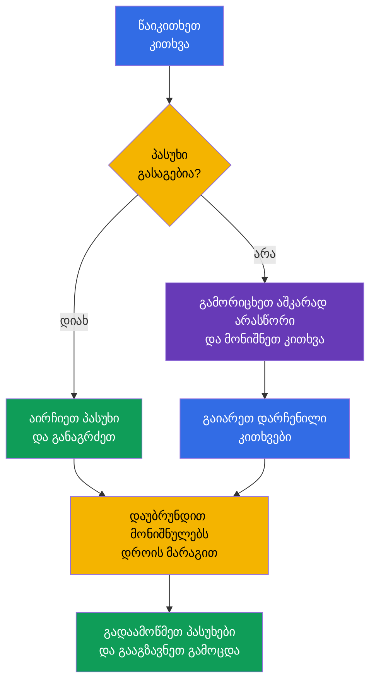

[Русская версия](ru.md) · [Eng version](README.md) · [Versión en español](es.md) · [Version française](fr.md) · [Deutsche Version](de.md) · [繁體中文版](tw.md) · [日本語版](jp.md)

# თავი 20. KCSA გამოცდა: სტრატეგია, დროის მართვა და საკონტროლო სია

> **შემდეგ რა არის.** წინა თავებში განხილული იყო KCSA-ს ექვსი დომენი: 4C მოდელიდან და კლასტერის კომპონენტებიდან supply chain-მდე და compliance-მდე. ეს დასკვნითი თავი ცოდნას პასუხის არჩევით გამოცდაზე მომზადების გეგმად გარდაქმნის. ის ცალკეულ დომენს არ მიეკუთვნება და ახალ წონას არ ამატებს. კურსის მაგალითები ორიენტირებულია Kubernetes `v1.36`-ზე.

## 20.1 გამოცდის ფორმატი და ლოგისტიკა

KCSA ამოწმებს cloud native და Kubernetes უსაფრთხოების კონცეპტუალურ გაგებას. ეს არის online proctored გამოცდა multiple choice კითხვებით და არა პრაქტიკული სამუშაო ბრძანების სტრიქონში. **Linux Foundation-ის 2026 წლის 1 სექტემბერს გადამოწმებული წესების თანახმად, სტანდარტული MCQ გამოცდა (multiple choice question, კითხვა პასუხის არჩევით) შეიცავს 60 კითხვას, გრძელდება 90 წუთი და ჩასაბარებლად მოითხოვს 75%-ს.**

**წესების მდგომარეობა 2026-09-01 თარიღისთვის.** Linux Foundation-ის ოფიციალურ ენათა მატრიცაში KCSA-სთვის მხოლოდ ინგლისური ენაა მითითებული. LF-ის multiple choice გამოცდების პოლიტიკა კრძალავს ინსტრუმენტებს, საცნობარო მასალებსა და გარე საიტებს. ივარჯიშეთ იმავე რეჟიმში: წაიკითხეთ stem და ყველა ვარიანტი ინგლისურად, გაიხსენეთ ტერმინი თარგმანის გარეშე, გამორიცხეთ ვარიანტები დოკუმენტაციის, ძიებისა და ჩანაწერების გარეშე. mock exam-ის შემდეგ ჩაიწერეთ შეცდომის ქართული ახსნა, მაგრამ შემდეგი მცდელობაც კვლავ ინგლისურად და დახურული რესურსებით შეასრულეთ.

კითხვების რაოდენობა, ხანგრძლივობა, გამსვლელი ქულა და სხვა საორგანიზაციო პირობები ამ მდგომარეობის თარიღის შემდეგ შეიძლება შეიცვალოს. რეგისტრაციამდე გადაამოწმეთ Linux Foundation-ის აქტუალური მასალები და არა ძველი ბლოგი, კურსის გადმოცემა ან სავარჯიშო ტესტი.

| რა უნდა გადაამოწმოთ რეგისტრაციამდე | რატომ არის ეს საჭირო |
|---|---|
| ფორმატი, კითხვების რაოდენობა და ხანგრძლივობა | ტემპის გამოსათვლელად და hands-on დავალებებისთვის რომ არ მოემზადოთ |
| აქტუალური გამსვლელი ქულა | mock exam-ებზე რეალისტური სამიზნე შედეგის დასადგენად |
| proctoring მოთხოვნები | დოკუმენტის, კამერის, მიკროფონის, ქსელისა და სამუშაო სივრცის წინასწარ შესამოწმებლად |
| გამოცდის წესები | სესიის დროს მასალებზე, აპლიკაციებსა და მოქმედებებზე დაწესებული შეზღუდვების დასაცავად |

დისტანციური proctoring გამოცდის პროცედურის ნაწილია და არა KCSA-ს კითხვა. ოფიციალური ინსტრუქციების შესაბამისად წინასწარ მოამზადეთ მშვიდი ადგილი, სტაბილური კავშირი და აღჭურვილობა. ნუ ეცდებით თემების უცოდინრობის გარე მასალებით კომპენსირებას: მათი ხელმისაწვდომობა კონკრეტული სესიის წესებით განისაზღვრება.

## 20.2 MCQ ტაქტიკა და ტიპური ხაფანგები

თავდაპირველად სრულად წაიკითხეთ კითხვა, შემდეგ კი გამოყავით, რას გეკითხებიან: განსაზღვრებას, საფრთხეს, ყველაზე პირდაპირ კონტროლს, ინსტრუმენტს თუ მისი მოქმედების საზღვარს. ვარიანტები ხშირად რამდენიმე სასარგებლო ტექნოლოგიას შეიცავს, მაგრამ სწორი იქნება ის, რომელიც **ზუსტად** აღწერილ პრობლემას წყვეტს.

სასარგებლო თანმიმდევრობა:

1. დაასახელეთ აქტივი და რისკი: ეს არის `Secret`, ქსელური ნაკადი, API-ზე წვდომა, image, worker node თუ runtime ქცევა.
2. გამიჯნეთ პრევენცია detection-ისა და აღდგენისგან. მაგალითად, admission-ს შეუძლია არ დაუშვას ობიექტი, Falco აკვირდება runtime მოვლენებს, ხოლო audit log აფიქსირებს Kubernetes API გამოძახებებს.
3. გამორიცხეთ პასუხები, რომლებიც 4C-ის სხვა ფენას მიეკუთვნება ან კითხვის პირობას არ პასუხობს.
4. ორი დამაჯერებელი ვარიანტის შემთხვევაში აირჩიეთ ყველაზე კონკრეტული და პირდაპირი. პირობას დაუზუსტებელ დაშვებებს ნუ დაუმატებთ.

| ფორმულირება ან ხაფანგი | სწორი მსჯელობა |
|---|---|
| „`Secret` კოდირებულია base64-ში“ | base64 არის encoding და არა encryption; საჭიროა RBAC, etcd-ის დაცვა და საჭიროების შემთხვევაში encryption at rest |
| „უნდა დავინახოთ, ვინ გამოიძახა Kubernetes API“ | audit logging და არა Falco ან image scanner |
| „უნდა აღმოვაჩინოთ shell გაშვებული კონტეინერის შიგნით“ | runtime detection, მაგალითად Falco; audit log პროცესის ყველა syscall-ს არ აფიქსირებს |
| „უნდა ავკრძალოთ `privileged` `Pod` შექმნამდე“ | PSA ან admission policy; RBAC განსაზღვრავს ობიექტის შექმნის უფლებას, მაგრამ არა მის ყველა ველს |
| „უნდა შევზღუდოთ კავშირები `Pod`-ებს შორის“ | `NetworkPolicy`; TLS და mTLS იცავს ნებადართულ არხს, მაგრამ თავისთავად ნაკადების allowlist-ს არ განსაზღვრავს |

სიტყვები **best**, **most appropriate**, **primarily** და **before creation** ჩვეულებრივ პასუხს ავიწროებს. სიტყვები **არა** და **გარდა** განსაკუთრებულ ყურადღებას მოითხოვს: ვარიანტის არჩევამდე კითხვა დადებითი ფორმით ჩამოაყალიბეთ. ნუ დახარჯავთ დროს ფარული ხაფანგის ძიებაში იქ, სადაც ერთი ვარიანტი მექანიზმის დანიშნულებას პირდაპირ შეესაბამება.

## 20.3 დროის მართვა: უპასუხეთ, მონიშნეთ, დაბრუნდით

90 წუთში 60 კითხვის შემთხვევაში საშუალო ბიუჯეტი შეადგენს **1,5 წუთს თითო კითხვაზე**. ეს არ ნიშნავს, რომ პასუხი აუცილებლად ზუსტად 90 წამში უნდა გასცეთ: მარტივი კითხვები სცენარებისთვის, ცხრილებისა და ორაზროვანი ფორმულირებებისთვის დროის მარაგს ქმნის.

პრაქტიკული გეგმა: პირველი გავლისას უპასუხეთ იმას, რაც იცით, და მონიშნეთ საეჭვო კითხვები, ზედმეტად ნუ შეყოვნდებით. მეორე გავლისას დაუბრუნდით მონიშნულ კითხვებს და დარჩენილი ვარიანტები ძირითად ცნებებს შეადარეთ. ბოლო წუთებში ხელახლა წაიკითხეთ უარყოფის შემცველი კითხვები და დარწმუნდით, რომ არჩეული ვარიანტი შენახულია. პასუხს მხოლოდ შფოთვის გამო ნუ შეცვლით: შეცვალეთ მაშინ, როდესაც მსჯელობაში კონკრეტული შეცდომა იპოვეთ.

## 20.4 ექვსი დომენის გამეორების საკონტროლო სია

დრო დაახლოებით ოფიციალური წონების პროპორციულად გაანაწილეთ. მაღალი წონა არ ნიშნავს, რომ დანარჩენი დომენები უნდა გამოტოვოთ: ნებისმიერი მათგანის კითხვამ შეიძლება საბოლოო შედეგი გადაწყვიტოს. თუ mock exam-ის შედეგები სუსტ დომენს აჩვენებს, ჯერ შეცდომები ცნებების მიხედვით გაარჩიეთ, შემდეგ კი დაკავშირებული თავები გაიმეორეთ.

| დომენი და წონა | რისი გარჩევა უნდა შეგეძლოთ | კურსის თავები |
|---|---|---|
| Overview of Cloud Native Security - 14% | 4C, shared responsibility, იზოლაცია, images და კოდი | [03](../03/ge.md)-[06](../06/ge.md) |
| Kubernetes Cluster Component Security - 22% | API Server, etcd, kubelet, runtime, kubeconfig, ქსელი და storage | [07](../07/ge.md)-[09](../09/ge.md) |
| Kubernetes Security Fundamentals - 22% | authentication, RBAC, PSS/PSA, `Secret`, `NetworkPolicy`, audit levels | [10](../10/ge.md)-[14](../14/ge.md) |
| Kubernetes Threat Model - 16% | trust boundaries და data flows, persistence, DoS, malicious code / compromised applications, attacker on the network, access to sensitive data, privilege escalation | [15](../15/ge.md)-[16](../16/ge.md) |
| Platform Security - 16% | SBOM, signatures, registry, admission, observability, PKI, TLS, mTLS და service mesh | [17](../17/ge.md)-[18](../18/ge.md) |
| Compliance and Security Frameworks - 10% | compliance frameworks, threat-modelling frameworks (მაგალითად STRIDE), supply-chain compliance, automation და tooling | [19](../19/ge.md) |

მოკლე საკონტროლო სია გამოცდის წინ:

- ახსენით განსხვავება authentication-ს, authorization-სა და admission-ს შორის;
- დაცული საზღვრის მიხედვით განასხვავეთ `NetworkPolicy`, TLS/mTLS, RBAC და encryption at rest;
- გახსოვდეთ, რომ base64-ში მოთავსებული `Secret` დაშიფრული არ არის;
- audit level შეუსაბამეთ მოვლენის მონაცემთა მოცულობას;
- განასხვავეთ scan, signature, SBOM და runtime detection;
- დაასახელეთ PSS/PSA, Falco, Trivy, Prometheus, service mesh, OPA/Gatekeeper, Kyverno და `ValidatingAdmissionPolicy`-ის დანიშნულება.

## 20.5 როგორ გამოვიყენოთ mock exam-ები

mock exam ამოწმებს არა მხოლოდ სწორი პასუხების რაოდენობას, არამედ გადაწყვეტილების ხარისხსაც. გაიარეთ ის ერთ სესიაში ტაიმერით, მინიშნებების გარეშე და გამოცდის ნებადართულ წესებთან მიახლოებულ პირობებში. დასრულების შემდეგ ჯერ შედეგი დააფიქსირეთ, შემდეგ გახსენით პასუხები და ახსნა.

გამოიყენეთ [KCSA mock exam-ები](../../mock/README.md) შემდეგი ციკლით:

1. გაიარეთ ნაკრები ტაიმერით და მონიშნეთ კითხვები, რომლებზეც პასუხი გამოიცანით ან ეჭვით აირჩიეთ.
2. თითოეული შეცდომა მიზეზის მიხედვით გაარჩიეთ: ცნება არ იცოდით, კონტროლი აგერიათ, უარყოფა ვერ წაიკითხეთ თუ დრო არასწორად გაანაწილეთ.
3. დაუბრუნდით ზემოთ მოცემული ცხრილიდან დომენის თავს და წესი საკუთარი სიტყვებით ჩამოაყალიბეთ.
4. კითხვები გარკვეული დროის შემდეგ გაიმეორეთ, რათა შეამოწმოთ გაგება და არა პასუხის ასოს დამახსოვრება.

მზადყოფნის შესახებ დასკვნას მხოლოდ ერთი მაღალი შედეგით ნუ გამოიტანთ. უმჯობესია რამდენიმე მცდელობაში სტაბილური შედეგი გქონდეთ და შეგეძლოთ ახსნათ, რატომ არის დანარჩენი სამი ვარიანტი არასწორი. თუ mock exam ერთ დომენში სისუსტეს აჩვენებს, მთელ კონსპექტს ნუ გადაწერთ: გაიმეორეთ მისი განსაზღვრებები, კონტროლების მოქმედების საზღვრები და ტიპური განსხვავებები.

## 20.6 როგორ გამოიყენება ეს პრაქტიკაში

საგამოცდო ტაქტიკა სერტიფიკაციის გარეთაც სასარგებლოა. incident-ის ან review-ის დროს ინჟინერიც ზუსტი კითხვის დასმით იწყებს: რომელი აქტივი დაზარალდა, სად არის ნდობის საზღვარი, რომელი კონტროლი აღკვეთს რისკს, რომელი აღმოაჩენს მოვლენას და რომელი მონაცემები დაადასტურებს დასკვნას. ასეთი თანმიმდევრობა ამცირებს პოპულარული ინსტრუმენტის არასწორი დანიშნულებით გამოყენების ცდუნებას.

გუნდს შეუძლია review-ისთვის კომპაქტური საკონტროლო სიის წარმოება: სანდოა თუ არა image, მინიმალურია თუ არა უფლებები, არსებობს თუ არა მოსალოდნელი ქსელური გზები, დაცულია თუ არა secrets, დაკვირვებადია თუ არა მოქმედებები და ცნობილია თუ არა გამონაკლისის მფლობელი. ეს threat model-ს ან policy-ს არ ცვლის, მაგრამ მათ თანმიმდევრულ გამოყენებაში ეხმარება.

## 20.7 Exam vocabulary / მინი-ლექსიკონი

| ტერმინი | მნიშვნელობა |
|---|---|
| MCQ | multiple choice question, კითხვა პასუხის არჩევით |
| proctoring | გამოცდის ჩაბარების კონტროლირებადი პროცედურა პროვაიდერის წესების შესაბამისად დაკვირვებით |
| mock exam | სავარჯიშო გამოცდა, რომელიც ფორმატისა და დროის შეზღუდვის იმიტაციას ახდენს |
| distractor | დამაჯერებელი, მაგრამ არასწორი პასუხის ვარიანტი |
| most appropriate | მითითება, რომ შინაარსით დასაშვები პასუხებიდან ყველაზე პირდაპირი და შესაფერისი აირჩიოთ |
| audit level | Kubernetes audit მოვლენის დეტალიზაციის დონე, მაგალითად `Metadata` ან `RequestResponse` |
| runtime detection | პროცესის ქცევის აღმოჩენა workload-ის გაშვების შემდეგ |

## 20.8 Exam Essentials / თავის შეჯამება

- 2026-09-01 მდგომარეობით KCSA მიჰყვება LF-ის სტანდარტულ MCQ ფორმატს: 60 კითხვა, 90 წუთი, გამსვლელი ქულა 75%; გამოცდა online რეჟიმში proctoring-ით ტარდება.
- კითხვების რაოდენობა, ხანგრძლივობა, გამსვლელი ქულა და სხვა საორგანიზაციო პირობები მცდელობამდე Linux Foundation-ის აქტუალურ მასალებში უნდა გადაამოწმოთ.
- MCQ-ში მითითებული აქტივის, საფრთხისა და ეტაპისთვის ყველაზე პირდაპირ კონტროლს ირჩევენ: პრევენციისთვის, detection-ისთვის ან გამოძიებისთვის.
- დაახლოებით 1,5 წუთი თითო კითხვაზე გეგმის აგებაში გეხმარებათ: უპასუხოთ ცნობილს, მონიშნოთ რთული, დაბრუნდეთ დროის მარაგით.
- ექვსი დომენის გამეორებამ უნდა გაითვალისწინოს 14/22/22/16/16/10 წონები და mock exam-ებში დაშვებული რეალური შეცდომები.
- mock exam სასარგებლოა მაშინ, როდესაც მის შემდეგ შეცდომების მიზეზებია გაანალიზებული და არა მხოლოდ სწორი პასუხების ასოები დათვლილი.

## 20.9 რა არ უნდა აგერიოთ და როგორ გვხვდება ეს გამოცდაზე

KCSA კითხვები მსგავსი მექანიზმების გარჩევას ამოწმებს. წაიკითხეთ პირობის არსებითი სახელები და ზმნები: „შექმნამდე აკრძალვა“ admission-ზე მიუთითებს, „ნებადართულია თუ არა identity“ - authorization-ზე, „ვინ გამოიძახა API“ - audit-ზე, „რა გააკეთა პროცესმა“ - runtime detection-ზე. თუ კითხვა ტრაფიკის კონფიდენციალურობას ეხება, TLS/mTLS არ აგერიოთ `NetworkPolicy`-ში; თუ შენახულ `Secret`-ზე წვდომას ეხება, ერთმანეთში არ აგერიოთ base64, RBAC და encryption at rest.

გამოცდის ფორმატის შესახებ კითხვამ შეიძლება არა ცვალებადი რიცხვის ცოდნა, არამედ KCSA-სა და CKS-ს შორის განსხვავების გაგება შეამოწმოს. KCSA კონცეპტუალურია და MCQ-ს იყენებს, ხოლო CKS პრაქტიკული დავალებების შესრულებაზეა ორიენტირებული. ზუსტი საორგანიზაციო პირობები აქტუალური ოფიციალური მასალებიდან აიღეთ და არა კითხვების ძველი ბანკიდან.

## 20.10 თვითშემოწმების კითხვები

### 1. რომელი მტკიცება აღწერს KCSA-ს ყველაზე უკეთ?

   - a. ეს მხოლოდ service mesh-ის კონფიგურაციის გამოცდაა.

   - b. ეს პრაქტიკული გამოცდაა, სადაც ყველა პასუხს `kubectl`-ის მეშვეობით იძლევიან.

   - c. ეს არის online proctored გამოცდა multiple choice კითხვებით, რომელიც კონცეპტუალურ ცოდნას ამოწმებს.

   - d. ეს Rego policy-ების წერის უნარის შემოწმებაა.

პასუხი და ახსნა

**სწორი პასუხი: c.** KCSA MCQ ფორმატში ამოწმებს cloud native და Kubernetes უსაფრთხოების კონცეპტუალურ გაგებას. ბრძანების სტრიქონში პრაქტიკული დავალებები დამახასიათებელია performance-based სერტიფიკაციებისთვის, მაგალითად CKS-ისთვის.

### 2. როგორ ჯობს მოიქცეთ კითხვასთან, რომელზეც ვარიანტების გონივრული გამორიცხვის შემდეგაც არ გაქვთ დარწმუნებული პასუხი?

   - a. კითხვა უპასუხოდ დატოვოთ და მცდელობა დაუყოვნებლივ დაასრულოთ, რათა არასწორი არჩევანის რისკი არ გაწიოთ.

   - b. აირჩიოთ ყველაზე დასაბუთებული ვარიანტი, მონიშნოთ კითხვა და პირველი გავლის შემდეგ დაუბრუნდეთ.

   - c. პირველივე საეჭვო კითხვისას შეცვალოთ წინა პასუხები, მაშინაც კი, თუ მათთვის დამაჯერებელი საფუძველი გქონდათ.

   - d. ამ კითხვაზე შეჩერდეთ და სრული დარწმუნების მიღწევამდე მთელი დარჩენილი დრო დახარჯოთ.

პასუხი და ახსნა

**სწორი პასუხი: b.** შეზღუდული დროის შემთხვევაში სასარგებლოა პირველი გავლის ტემპის შენარჩუნება და შემდეგ მონიშნულ კითხვებთან დაბრუნება. გამოცდის ინტერფეისის კონკრეტული შესაძლებლობები სესიამდე უნდა გადაამოწმოთ.

### 3. კითხვაში წერია: „რომელი კონტროლი აჩვენებს ყველაზე პირდაპირ, ვინ გაგზავნა `delete secrets` მოთხოვნა Kubernetes API-ში?“ რა უნდა აირჩიოთ?

   - a. `Secret`-ის base64 encoding.

   - b. Kubernetes audit logging.

   - c. image scan.

   - d. `NetworkPolicy`.

პასუხი და ახსნა

**სწორი პასუხი: b.** Audit log აფიქსირებს Kubernetes API მოვლენებსა და მათ კონტექსტს, მათ შორის შესაბამისი audit policy-ის არსებობისას ინიციატორსაც. Image scan აანალიზებს artifact-ს, `NetworkPolicy` მართავს ქსელურ ნაკადებს, ხოლო base64 audit მექანიზმი არ არის.

> **შემდეგ სად წავიდეთ.** KCSA-ს შემდეგ ადმინისტრაციული პრაქტიკა CKA კურსში გაიღრმავეთ. Linux Foundation CKS-ის მცდელობამდე ჩაბარებულ CKA-ს მოითხოვს; CKS კურსი შეგიძლიათ დამატებით საკითხავად გამოიყენოთ, მაგრამ ის ამ prerequisite-ს არ ცვლის.

**KCSA mock exam-ები:** [Mock Exam 01](../../mock/01/README.md) · [Mock Exam 02](../../mock/02/README.md) - თითოეულში 60 კითხვა, closed-book, 90 წუთი (იხ. §20.5).

[სარჩევი](../README_GE.md) · [თავი 19](../19/ge.md)
