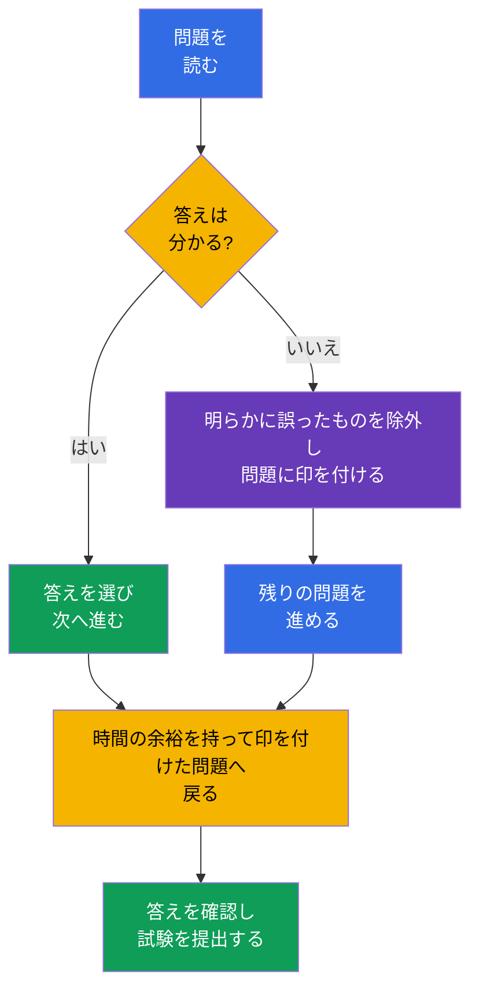

[Русская версия](ru.md) · [Eng version](README.md) · [Versión en español](es.md) · [Version française](fr.md) · [Deutsche Version](de.md) · [ქართული ვერსია](ge.md) · [繁體中文版](tw.md)

# 第20章 KCSA 試験: 戦略、時間管理、チェックリスト

> **次へ。** これまでの章では、4C モデルとクラスターコンポーネントから supply chain とコンプライアンスまで、KCSA の 6 つのドメインを解説しました。この最終章では、知識を multiple choice 試験に向けた準備計画へと変えます。特定のドメインには属さず、新たな配点も追加しません。コースの例は Kubernetes `v1.36` を対象としています。

## 20.1 試験の形式と運用

KCSA は cloud native と Kubernetes のセキュリティに関する概念的な理解を確認します。これは online proctored 試験であり、コマンドラインでの実技ではなく、multiple choice 問題で構成されます。**2026 年 9 月 1 日に確認した Linux Foundation の規則によると、標準の MCQ 試験 (multiple choice question、選択式問題) は 60 問、90 分で、合格には 75% が必要です。**

**2026-09-01 時点の規則。** Linux Foundation の公式言語マトリクスでは、KCSA は英語のみとされています。multiple choice 試験に関する LF のポリシーは、ツール、参照資料、外部サイトを禁止しています。同じ条件で練習してください。設問文とすべての選択肢を英語で読み、翻訳せずに用語を思い出し、ドキュメント、検索、メモなしで選択肢を除外します。mock の後には誤りの日本語での説明を書きますが、次の試行も再び英語で、リソースを閉じて解いてください。

問題数、試験時間、合格点、その他の運用条件は、この時点以降に変更される可能性があります。登録前には、古いブログ、コースの説明、練習問題ではなく、最新の Linux Foundation 資料を再確認してください。

| 申込み前に確認すること | 理由 |
|---|---|
| 形式、問題数、試験時間 | ペースを計算し、hands-on 課題に備えないため |
| 最新の合格点 | mock で現実的な目標スコアを設定するため |
| proctoring の要件 | 身分証明書、カメラ、マイク、ネットワーク、作業場所を事前に確認するため |
| 試験規則 | セッション中の資料、アプリケーション、行動に関する制限に違反しないため |

リモート proctoring は KCSA の問題ではなく、試験手続きの一部です。公式の案内に従い、静かな場所、安定した接続、機器を事前に準備してください。テーマの知識不足を外部資料で補おうとしないでください。それらを利用できるかどうかは、各セッションの規則によって決まります。

## 20.2 MCQ の戦術と典型的な罠

まず問題全体を読み、何を問うているかを見極めます。定義、脅威、最も直接的なコントロール、ツール、またはその適用範囲です。選択肢には複数の有用な技術が含まれることがよくありますが、正解は説明された問題を**まさに**解決するものです。

有用な手順:

1. 資産とリスクを特定します。`Secret`、ネットワークフロー、API アクセス、イメージ、ワーカーノード、runtime の動作のどれでしょうか。
2. 予防を検知および復旧から分けます。たとえば、admission はオブジェクトを許可しないようにでき、Falco は runtime イベントを監視し、audit log は Kubernetes API 呼び出しを記録します。
3. 別の 4C 層に属する、または問題の条件に答えていない選択肢を除外します。
4. もっともらしい選択肢が 2 つある場合は、より具体的で直接的なものを選びます。記載のない仮定を条件に追加しないでください。

| 表現または罠 | 正しい考え方 |
|---|---|
| 「`Secret` は base64 でエンコードされている」 | base64 は encryption ではなくエンコードです。RBAC、etcd の保護、必要に応じて encryption at rest が必要です |
| 「誰が Kubernetes API を呼び出したかを確認する必要がある」 | Falco や image scanner ではなく audit logging |
| 「実行中のコンテナ内の shell を検知する必要がある」 | Falco などの runtime detection。audit log はプロセスのすべての syscall を記録するわけではありません |
| 「`privileged` `Pod` を作成前に禁止する必要がある」 | PSA または admission policy。RBAC はオブジェクトの作成権限を定義しますが、そのすべてのフィールドを定義するわけではありません |
| 「`Pod` 間の接続を制限する必要がある」 | `NetworkPolicy`。TLS と mTLS は許可されたチャネルを保護しますが、それ自体ではフローの allowlist を設定しません |

**best**、**most appropriate**、**primarily**、**before creation** という語は、通常、答えを絞り込みます。**not** と **except** には特に注意が必要です。選択肢を選ぶ前に、問題を肯定文に言い換えてください。1 つの選択肢がメカニズムの目的に直接対応している場合、隠れた罠を探して時間を使わないでください。

## 20.3 時間管理: 答える、印を付ける、戻る

90 分で 60 問の場合、平均の持ち時間は**1 問あたり 1.5 分**です。これは厳密に 90 秒ずつで答える義務ではありません。簡単な問題で、シナリオ、表、曖昧な表現に使う余裕を作れます。

実用的な計画は次のとおりです。1 回目では、分かる問題に答え、迷う問題には印を付け、長くとどまらないようにします。2 回目では印を付けた問題に戻り、残った選択肢を主要な概念と比較します。最後の数分で否定を含む問題を読み直し、選択肢が保存されていることを確認してください。不安だけを理由に答えを変えないでください。推論に具体的な誤りを見つけたときに変えてください。

## 20.4 6 つのドメイン別復習チェックリスト

公式の配点におおよそ比例して時間を配分してください。配点が高いことは、他のドメインを飛ばしてよいという意味ではありません。どのドメインの問題でも最終結果を左右し得ます。mock の結果が弱いドメインを示した場合は、まず概念ごとに誤りを分析し、その後で関連する章を復習してください。

| ドメインと配点 | 区別できるべきこと | コースの章 |
|---|---|---|
| Overview of Cloud Native Security - 14% | 4C、shared responsibility、分離、イメージ、コード | [03](../03/jp.md)-[06](../06/jp.md) |
| Kubernetes Cluster Component Security - 22% | API Server、etcd、kubelet、runtime、kubeconfig、ネットワーク、storage | [07](../07/jp.md)-[09](../09/jp.md) |
| Kubernetes Security Fundamentals - 22% | authentication、RBAC、PSS/PSA、`Secret`、`NetworkPolicy`、audit levels | [10](../10/jp.md)-[14](../14/jp.md) |
| Kubernetes Threat Model - 16% | trust boundaries と data flows、persistence、DoS、malicious code / compromised applications、attacker on the network、access to sensitive data、privilege escalation | [15](../15/jp.md)-[16](../16/jp.md) |
| Platform Security - 16% | SBOM、署名、registry、admission、observability、PKI、TLS、mTLS、service mesh | [17](../17/jp.md)-[18](../18/jp.md) |
| Compliance and Security Frameworks - 10% | compliance frameworks、threat-modelling frameworks (例: STRIDE)、supply-chain compliance、automation、tooling | [19](../19/jp.md) |

試験前の短いチェックリスト:

- authentication、authorization、admission の違いを説明する。
- `NetworkPolicy`、TLS/mTLS、RBAC、encryption at rest を、保護する境界によって区別する。
- base64 の `Secret` は暗号化されていないことを覚えておく。
- audit level をイベントデータの量に対応付ける。
- scan、署名、SBOM、runtime detection を区別する。
- PSS/PSA、Falco、Trivy、Prometheus、service mesh、OPA/Gatekeeper、Kyverno、`ValidatingAdmissionPolicy` の目的を説明する。

## 20.5 mock 試験の使い方

mock は正答数だけでなく、解答の質も確認します。タイマーを使い、ヒントなしで、許可される試験規則に近い条件の 1 セッションで受けてください。完了後、まず結果を記録し、それから解答と解説を開きます。

[KCSA mock 試験](../../mock/README.md)を、次のサイクルで利用します:

1. タイマー下でセットを解き、答えを推測した、または迷って選んだ問題に印を付けます。
2. すべての誤りを原因別に分析します。概念が不足していた、コントロールを取り違えた、否定を読み落とした、または時間配分を誤った、のいずれかです。
3. 上の表にあるドメインの章へ戻り、自分の言葉でルールを表現します。
4. しばらく時間を置いて問題を繰り返し、答えの文字の記憶ではなく理解を確認します。

1 回の高得点だけで準備ができたと結論付けないでください。複数回の試行で安定した結果を確認し、他の 3 つの選択肢がなぜ誤りかを説明できるほうがよいです。mock が 1 つのドメインの弱さを示した場合、ノート全体を書き直さないでください。その定義、コントロールの適用範囲、典型的な対比を復習してください。

## 20.6 実務での適用

試験の戦術は、認定以外でも役立ちます。インシデントや review においても、エンジニアは正確な問題設定から始めます。どの資産が影響を受けたか、信頼境界はどこか、どのコントロールがリスクを防ぐか、どれがイベントを検知するか、どのデータが結論を裏付けるかを考えます。この順序により、人気のツールを用途に合わず適用する誘惑を減らせます。

チームは review 用にコンパクトなチェックリストを維持できます。イメージは信頼できるか、権限は最小か、想定されたネットワーク経路があるか、Secret は保護されているか、アクションは観測可能か、例外の所有者は明確かを確認します。これは threat model や policy に取って代わるものではありませんが、それらを一貫して適用する助けになります。

## 20.7 Exam vocabulary / ミニ用語集

| 用語 | 意味 |
|---|---|
| MCQ | multiple choice question、選択式問題 |
| proctoring | プロバイダーの規則に従った監督下の試験手続き |
| mock exam | 試験形式と時間制限を模倣する練習試験 |
| distractor | もっともらしいが誤った選択肢 |
| most appropriate | 意味として許容される選択肢から、最も直接的で適切な答えを選ぶ指示 |
| audit level | `Metadata` や `RequestResponse` など、Kubernetes audit イベントの詳細レベル |
| runtime detection | ワークロードの起動後にプロセスの動作を検知すること |

## 20.8 Exam Essentials / 章のまとめ

- 2026-09-01 時点で、KCSA は標準の LF MCQ 形式に従います。60 問、90 分、合格点 75% で、試験は proctoring 付きの online で行われます。
- 問題数、試験時間、合格点、その他の運用条件は、受験前に最新の Linux Foundation 資料で再確認する必要があります。
- MCQ では、指定された資産、脅威、段階に対して最も直接的なコントロールを選びます。その段階は予防、検知、または調査です。
- 1 問あたり約 1.5 分という目安は、分かる問題に答え、難しいものに印を付け、余裕を持って戻る計画に役立ちます。
- 6 つのドメインの復習では、14/22/22/16/16/10 の配点と mock での実際の誤りを考慮する必要があります。
- mock は、その後に正解の文字を数えるだけでなく、誤りの原因を分析してこそ役立ちます。

## 20.9 混同しないために、試験での出題例

KCSA の問題では、似たメカニズムを区別できるかを確認します。条件の名詞と動詞を読んでください。「作成前に禁止」は admission、「identity が許可されているか」は authorization、「誰が API を呼び出したか」は audit、「プロセスが何をしたか」は runtime detection につながります。問題がトラフィックの機密性に関する場合、TLS/mTLS と `NetworkPolicy` を混同しないでください。保存された `Secret` へのアクセスに関する場合は、base64、RBAC、encryption at rest を混同しないでください。

試験形式に関する問題は、変動し得る数値の記憶ではなく、KCSA と CKS の違いの理解を確認することがあります。KCSA は概念的で MCQ を使用しますが、CKS は実技タスクの実行を対象としています。正確な運用条件は、古い問題バンクではなく最新の公式資料から確認してください。

## 20.10 自己確認問題

### 1. KCSA を最もよく説明しているのはどの記述ですか。

   - a. service mesh の設定だけに関する試験です。

   - b. すべての回答を `kubectl` で行う実技試験です。

   - c. cloud native と Kubernetes セキュリティの概念的知識を確認する、multiple choice 問題による online proctored 試験です。

   - d. Rego policy を書くスキルの試験です。

回答と解説

**正解: c.** KCSA は MCQ 形式で cloud native と Kubernetes セキュリティの概念的理解を確認します。コマンドラインでの実技タスクは、たとえば CKS のような performance-based 認定に特徴的です。

### 2. 選択肢を合理的に除外しても確信を持てる答えがない問題には、どのように対応するのが最善ですか。

   - a. 誤った選択をするリスクを避けるため、回答せずに直ちに試行を終了する。

   - b. 最も根拠のある選択肢を選び、問題に印を付け、1 回目の通過後に戻る。

   - c. 最初の迷う問題が出たとき、確信を持てる根拠があった場合でも、以前の回答を変更する。

   - d. この問題で止まり、完全に確信できるまで残り時間をすべて使う。

回答と解説

**正解: b.** 時間が限られている場合は、1 回目の通過のペースを保ち、その後で印を付けた問題に戻るのが有用です。試験インターフェースの具体的な機能は、セッション前に確認する必要があります。

### 3. 問題に「Kubernetes API に `delete secrets` リクエストを送ったのが誰かを、最も直接的に示すコントロールはどれですか」とあります。何を選びますか。

   - a. `Secret` の base64 エンコード。

   - b. Kubernetes audit logging。

   - c. image scan。

   - d. `NetworkPolicy`。

回答と解説

**正解: b.** Audit log は Kubernetes API イベントとそのコンテキストを記録し、適切な audit policy ではイニシエーターも含まれます。Image scan はアーティファクトを分析し、`NetworkPolicy` はネットワークフローを管理します。また、base64 は監査メカニズムではありません。

> **次へ。** KCSA の後は、CKA コースで管理の実践を深めてください。Linux Foundation は、CKS を受験する前に CKA に合格していることを求めています。CKS コースは追加の読み物として利用できますが、この prerequisite の代わりにはなりません。

**KCSA mock 試験:** [Mock Exam 01](../../mock/01/README.md) · [Mock Exam 02](../../mock/02/README.md) - 各 60 問、closed-book、90 分 (§20.5 を参照)。

[目次](../README_JP.md) · [第19章](../19/jp.md)
