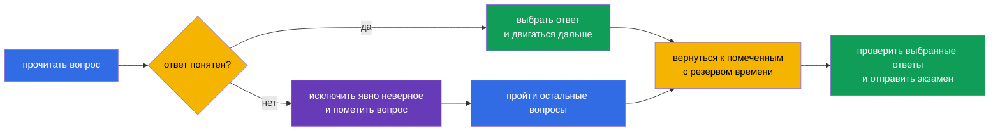

> **Язык:** русский. Переводы будут добавлены после публикации соответствующих файлов.

# Глава 20. Экзамен KCSA: стратегия, тайм-менеджмент и чеклист

> **Что дальше.** Предыдущие главы разобрали шесть доменов KCSA: от модели 4C и компонентов кластера до supply chain и комплаенса. Эта финальная глава превращает знания в план подготовки к экзамену с выбором ответа. Она не относится к отдельному домену и не добавляет новый вес. Примеры курса ориентированы на Kubernetes `v1.36`.

## 20.1 Формат и логистика экзамена

KCSA проверяет концептуальное понимание безопасности cloud native и Kubernetes. Это online proctored экзамен с вопросами multiple choice, а не практическая работа в командной строке. На официальной странице Linux Foundation, проверенной 1 сентября 2026 года, указан лимит **90 минут** и удалённый прокторинг.

**Снимок правил на 2026-09-01.** Официальная матрица языков Linux Foundation указывает для KCSA только английский язык. Политика LF для экзаменов multiple choice запрещает инструменты, справочные материалы и внешние сайты. Репетируйте в таком же режиме: читайте stem и все варианты на английском, вспоминайте термин без перевода, исключайте варианты без документации, поиска и заметок. После мока записывайте русское объяснение ошибки, но следующую попытку снова решайте по-английски и с закрытыми ресурсами.

В учебных материалах этого курса и в моке используется ориентир **около 60 вопросов**. В общей справке LF для multiple choice на дату снимка фигурируют 90 минут и 75%, но это общий текущий ориентир, не неизменный договор для KCSA. Перед регистрацией не полагайтесь на старый блог, пересказ курса или этот ориентир: проверьте актуальные число вопросов, проходной балл, допустимые документы, требования к рабочему месту и правила пересдачи в [странице KCSA Linux Foundation](https://training.linuxfoundation.org/certification/kubernetes-and-cloud-native-security-associate-kcsa/) и Candidate Handbook.

| Что проверить до записи | Зачем это нужно |
|---|---|
| формат, число вопросов и длительность | рассчитать темп и не готовиться к hands-on заданиям |
| актуальный проходной балл | задать реалистичный целевой результат на моках |
| требования proctoring | заранее проверить документ, камеру, микрофон, сеть и рабочее помещение |
| правила экзамена | не нарушить ограничения на материалы, приложения и действия во время сессии |

Удалённый прокторинг - часть процедуры экзамена, а не вопрос KCSA. Подготовьте тихое место, устойчивое подключение и оборудование заранее по официальным инструкциям. Не пытайтесь компенсировать незнание тем внешними материалами: их доступность определяется правилами конкретной сессии.

## 20.2 Тактика MCQ и типичные ловушки

Сначала прочитайте вопрос целиком, затем выделите, о чём он спрашивает: определение, угроза, наиболее прямой контроль, инструмент или граница его действия. Варианты часто содержат несколько полезных технологий, но правильным будет тот, который решает **именно** описанную проблему.

Полезная последовательность:

1. Назовите актив и риск: это `Secret`, сетевой поток, API-доступ, образ, рабочий узел или runtime-поведение.
2. Отделите профилактику от детекта и восстановления. Например, admission может не допустить объект, Falco наблюдает runtime-события, а audit log фиксирует вызовы Kubernetes API.
3. Исключите ответы, которые относятся к другому слою 4C или не отвечают на условие вопроса.
4. При двух правдоподобных вариантах выберите наиболее конкретный и прямой. Не добавляйте к условию неуказанные предположения.

| Формулировка или ловушка | Корректная мысль |
|---|---|
| «`Secret` закодирован в base64» | base64 - кодирование, а не encryption; нужны RBAC, защита etcd и при необходимости encryption at rest |
| «Нужно увидеть, кто вызвал Kubernetes API» | audit logging, а не Falco или image scanner |
| «Нужно обнаружить shell внутри запущенного контейнера» | runtime detection, например Falco; audit log не фиксирует все syscall процесса |
| «Нужно запретить `privileged` `Pod` до создания» | PSA или admission policy; RBAC определяет право создать объект, но не все его поля |
| «Нужно ограничить связи между `Pod`» | `NetworkPolicy`; TLS и mTLS защищают разрешённый канал, но сами не задают allowlist потоков |

Слова **best**, **most appropriate**, **primarily** и **before creation** обычно сужают ответ. Слова **не** и **кроме** требуют особого внимания: прежде чем выбирать вариант, перефразируйте вопрос положительно. Не тратьте время на поиск скрытой уловки там, где один вариант прямо соответствует назначению механизма.

## 20.3 Тайм-менеджмент: ответить, пометить, вернуться

При 90 минутах и ориентире около 60 вопросов средний бюджет составляет примерно **1,5 минуты на вопрос**. Это не обязанность отвечать ровно за 90 секунд: простые вопросы создают резерв для сценариев, таблиц и неоднозначных формулировок.

Практичный план: в первом проходе отвечайте на известное и помечайте сомнительное, не задерживаясь надолго. Во втором проходе вернитесь к помеченным вопросам и сравните оставшиеся варианты с ключевыми понятиями. В последние минуты перечитайте вопросы с отрицанием и убедитесь, что выбранный вариант сохранён. Не меняйте ответ только из тревоги: меняйте его, когда нашли конкретную ошибку в рассуждении.

## 20.4 Чеклист повторения по шести доменам

Уделяйте время примерно пропорционально официальным весам. Высокий вес не означает, что надо пропустить остальные домены: вопрос из любого из них может решить итоговый результат. Если результаты мока показывают слабый домен, сначала разберите ошибки по понятиям, затем повторите связанные главы.

| Домен и вес | Что уметь различать | Главы курса |
|---|---|---|
| Overview of Cloud Native Security - 14% | 4C, shared responsibility, изоляцию, образы и код | [03](../03/ru.md)-[06](../06/ru.md) |
| Kubernetes Cluster Component Security - 22% | API Server, etcd, kubelet, runtime, kubeconfig, сеть и storage | [07](../07/ru.md)-[09](../09/ru.md) |
| Kubernetes Security Fundamentals - 22% | authentication, RBAC, PSS/PSA, `Secret`, `NetworkPolicy`, audit levels | [10](../10/ru.md)-[14](../14/ru.md) |
| Kubernetes Threat Model - 16% | trust boundaries и data flows, persistence, DoS, malicious code / compromised applications, attacker on the network, access to sensitive data, privilege escalation | [15](../15/ru.md)-[16](../16/ru.md) |
| Platform Security - 16% | SBOM, подписи, registry, admission, observability, PKI, TLS, mTLS и service mesh | [17](../17/ru.md)-[18](../18/ru.md) |
| Compliance and Security Frameworks - 10% | compliance frameworks, threat-modelling frameworks (например STRIDE), supply-chain compliance, automation и tooling | [19](../19/ru.md) |

Короткий чеклист перед экзаменом:

- объяснить разницу между authentication, authorization и admission;
- отличить `NetworkPolicy`, TLS/mTLS, RBAC и encryption at rest по защищаемой границе;
- помнить, что `Secret` в base64 не зашифрован;
- соотнести audit level с объёмом данных события;
- отличить scan, подпись, SBOM и runtime detection;
- назвать назначение PSS/PSA, Falco, Trivy, Prometheus, service mesh, OPA/Gatekeeper, Kyverno и `ValidatingAdmissionPolicy`.

## 20.5 Как пользоваться мок-экзаменами

Мок проверяет не только число верных ответов, но и качество решения. Проходите его в одном сеансе с таймером, без подсказок и в условиях, близких к разрешённым правилам экзамена. После завершения сначала зафиксируйте результат, затем открывайте ключи и пояснения.

Используйте [мок-экзамены KCSA](../../mock/README.md) по циклу:

1. Пройти набор под таймером и отметить вопросы, где ответ был угадан или выбран с сомнением.
2. Разобрать каждую ошибку по причине: не хватило понятия, перепутан контроль, не прочитано отрицание или неверно распределено время.
3. Вернуться к главе домена из таблицы выше и сформулировать правило своими словами.
4. Повторить вопросы спустя время, чтобы проверить понимание, а не память о букве ответа.

Не делайте вывод о готовности только по одному высокому результату. Лучше видеть стабильный результат в нескольких попытках и уметь объяснить, почему неверны остальные три варианта. Если мок показывает слабость в одном домене, не переписывайте весь конспект: повторите его определения, границы действия контролей и типичные контрасты.

## 20.6 Как это применяют на практике

Экзаменационная тактика полезна и вне сертификации. При инциденте или review инженер тоже начинает с точной постановки вопроса: какой актив затронут, где граница доверия, какой контроль предотвратит риск, какой обнаружит событие и какие данные подтвердят вывод. Такой порядок уменьшает соблазн применять популярный инструмент не по назначению.

Команда может поддерживать компактный чеклист для review: доверенный ли образ, минимальны ли права, есть ли ожидаемые сетевые пути, защищены ли секреты, наблюдаемы ли действия и известен ли владелец исключения. Это не заменяет threat model или policy, но помогает применить их последовательно.

## 20.7 Exam vocabulary / Мини-глоссарий

| Термин | Значение |
|---|---|
| MCQ | multiple choice question, вопрос с выбором ответа |
| proctoring | контролируемая процедура сдачи экзамена с наблюдением по правилам провайдера |
| mock exam | тренировочный экзамен, имитирующий формат и ограничение времени |
| distractor | правдоподобный, но неверный вариант ответа |
| most appropriate | указание выбрать наиболее прямой и подходящий ответ среди допустимых по смыслу |
| audit level | уровень детализации события Kubernetes audit, например `Metadata` или `RequestResponse` |
| runtime detection | обнаружение поведения процесса после запуска рабочей нагрузки |

## 20.8 Exam Essentials / Итоги главы

- KCSA - online proctored MCQ-экзамен; на проверенной странице Linux Foundation указана длительность 90 минут.
- Ориентир около 60 вопросов нужен для тренировки темпа, а текущий проходной балл и правила регистрации необходимо перепроверить у Linux Foundation перед экзаменом.
- В MCQ выбирают наиболее прямой контроль для указанного актива, угрозы и этапа: профилактики, детекта или расследования.
- Приблизительно 1,5 минуты на вопрос помогают построить план: ответить на известное, пометить сложное, вернуться с резервом.
- Повторение по шести доменам должно учитывать веса 14/22/22/16/16/10 и реальные ошибки в моках.
- Мок полезен, когда после него разобраны причины ошибок, а не только подсчитаны правильные буквы.

## 20.9 Не путать и как это встречается на экзамене

Вопросы KCSA проверяют различение похожих механизмов. Читайте существительные и глаголы условия: «запретить до создания» ведёт к admission, «разрешено ли identity» - к authorization, «кто вызвал API» - к audit, «что сделал процесс» - к runtime detection. Если вопрос про конфиденциальность трафика, не путайте TLS/mTLS с `NetworkPolicy`; если про доступ к сохранённому `Secret`, не путайте base64, RBAC и encryption at rest.

Вопрос о формате экзамена может проверять не память о непостоянной цифре, а понимание различия KCSA и CKS. KCSA концептуален и использует MCQ, тогда как CKS ориентирован на выполнение практических задач. Точные организационные условия берите из актуальных официальных материалов, а не из старого банка вопросов.

## 20.10 Вопросы для самопроверки

### 1. Какое утверждение лучше всего описывает KCSA?

   - a. Это экзамен только по настройке service mesh.

   - b. Это практический экзамен, где все ответы дают через `kubectl`.

   - c. Это online proctored экзамен с вопросами multiple choice, проверяющий концептуальные знания.

   - d. Это проверка навыков написания Rego-политик.

Ответ и разбор

**Верный ответ: c.** KCSA проверяет концептуальное понимание безопасности cloud native и Kubernetes в формате MCQ. Практические задания в командной строке характерны для performance-based сертификаций, например CKS.

### 2. Как лучше поступить с вопросом, на который после разумного исключения вариантов всё ещё нет уверенного ответа?

   - a. Закрыть экзамен без ответа.

   - b. Выбрать наиболее обоснованный вариант, пометить вопрос и вернуться к нему после первого прохода.

   - c. Сразу изменить все предыдущие ответы.

   - d. Потратить всё оставшееся время, пока не появится полная уверенность.

Ответ и разбор

**Верный ответ: b.** При ограничении времени полезно сохранить темп: решить известные вопросы, создать резерв и затем вернуться к сомнительным. Конкретные правила интерфейса экзамена следует проверить до сессии.

### 3. В вопросе говорится: «Какой контроль наиболее прямо показывает, кто отправил запрос `delete secrets` в Kubernetes API?» Что выбрать?

   - a. base64-кодирование `Secret`.

   - b. Kubernetes audit logging.

   - c. image scan.

   - d. `NetworkPolicy`.

Ответ и разбор

**Верный ответ: b.** Audit log фиксирует события Kubernetes API и их контекст, включая инициатора при соответствующей audit policy. Image scan анализирует артефакт, `NetworkPolicy` управляет потоками сети, а base64 не является механизмом аудита.

> **Куда дальше.** После KCSA углубите административную практику в курсе CKA. Linux Foundation требует сданный CKA перед попыткой CKS; курс CKS можно использовать как дополнительное чтение, но он не заменяет этот prerequisite.

[Оглавление](../README_RU.md) · [Глава 19](../19/ru.md)
