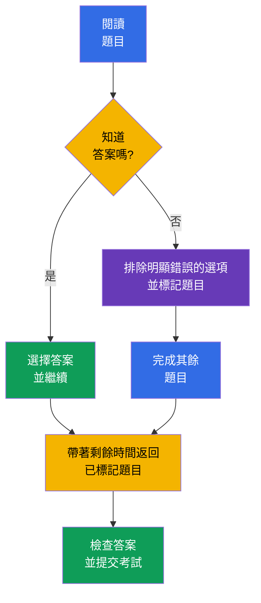

[Русская версия](ru.md) · [Eng version](README.md) · [Versión en español](es.md) · [Version française](fr.md) · [Deutsche Version](de.md) · [ქართული ვერსია](ge.md) · [日本語版](jp.md)

# 第 20 章. KCSA 考試: 策略、時間管理與檢查清單

> **接下來。** 前幾章介紹了 KCSA 的六個領域: 從 4C 模型和叢集元件，到 supply chain 與 compliance。本最終章將知識轉化為 multiple choice 考試的備考計畫。它不屬於單一領域，也不增加新的權重。課程範例以 Kubernetes `v1.36` 為準。

## 20.1 考試格式與流程

KCSA 檢驗對 cloud native 與 Kubernetes 安全性的概念理解。這是一項有監考的 online 考試，題型為 multiple choice，而非在命令列進行實作。**依據截至 2026 年 9 月 1 日確認的 Linux Foundation 規則，標準 MCQ 考試 (multiple choice question，選擇題) 包含 60 題，時長 90 分鐘，及格分數為 75%。**

**2026-09-01 規則快照。** Linux Foundation 的官方語言矩陣僅列出 KCSA 提供英語。LF 的 multiple choice 考試政策禁止使用工具、參考資料與外部網站。請以相同模式練習: 用英語閱讀題幹和所有選項，不經翻譯回想術語，且不使用文件、搜尋或筆記來排除選項。完成 mock 後記下錯誤的中文說明，但下一次嘗試仍應以英語作答並關閉所有資源。

題數、時長、及格分數與其他行政條件可能在快照日期後變更。註冊前，請重新確認最新的 Linux Foundation 資料，而非舊部落格、課程轉述或模擬測驗。

| 報名之前要確認的事項 | 原因 |
|---|---|
| 格式、題數與時長 | 計算作答節奏，並避免為 hands-on 題目準備 |
| 最新及格分數 | 為 mock 設定實際可行的目標成績 |
| proctoring 要求 | 預先檢查證件、攝影機、麥克風、網路與工作環境 |
| 考試規則 | 避免在考試期間違反對資料、應用程式與行為的限制 |

遠端監考是考試流程的一部分，不是 KCSA 題目。請依官方指引預先備妥安靜場所、穩定連線與設備。不要試圖以外部資料彌補對主題的不了解: 其可用性由該次考試的規則決定。

## 20.2 MCQ 策略與常見陷阱

先完整閱讀題目，接著找出它問的是什麼: 定義、威脅、最直接的控制措施、工具，或其作用邊界。選項常包含多種有用技術，但正確答案會是解決**正是**所描述問題的那一個。

有用的順序:

1. 指出資產與風險: 它是 `Secret`、網路流量、API 存取、映像檔、工作節點，還是 runtime 行為。
2. 區分預防、偵測與復原。例如，admission 可以阻止物件進入，Falco 觀察 runtime 事件，而 audit log 記錄 Kubernetes API 呼叫。
3. 排除屬於另一個 4C 層級，或未回應題目條件的答案。
4. 若兩個選項都合理，選最具體且最直接的一個。不要為題目加入未說明的假設。

| 敘述或陷阱 | 正確觀念 |
|---|---|
| 「`Secret` 已以 base64 編碼」 | base64 是編碼，不是 encryption；需要 RBAC、etcd 保護，以及必要時的 encryption at rest |
| 「需要查看誰呼叫了 Kubernetes API」 | audit logging，而不是 Falco 或 image scanner |
| 「需要偵測執行中 container 內的 shell」 | runtime detection，例如 Falco；audit log 不會記錄程序的所有 syscall |
| 「需要在建立前禁止 `privileged` `Pod`」 | PSA 或 admission policy；RBAC 決定建立物件的權限，但不涵蓋其所有欄位 |
| 「需要限制 `Pod` 之間的連線」 | `NetworkPolicy`；TLS 與 mTLS 保護已允許的通道，但本身不會設定流量 allowlist |

**best**、**most appropriate**、**primarily** 與 **before creation** 等字詞通常會縮小答案範圍。**not** 與 **except** 等字詞需要特別留意: 選擇選項前，先將題目改述為肯定句。不要在某個選項直接符合機制用途時，浪費時間尋找隱藏陷阱。

## 20.3 時間管理: 作答、標記、返回

在 90 分鐘內作答 60 題，平均預算為**每題 1.5 分鐘**。這不是要求恰好在 90 秒內回答: 簡單題會為情境題、表格與模稜兩可的表述留下餘裕。

實用計畫: 第一輪先回答已知題目並標記可疑題目，不要停留太久。第二輪回到標記題目，將剩餘選項與核心概念比較。最後幾分鐘重新閱讀含否定詞的題目，並確認已儲存選項。不要只因焦慮而更改答案: 當你找到推理中的具體錯誤時才更改。

## 20.4 六個領域的複習檢查清單

投入時間大致應與官方權重成比例。高權重不表示可以跳過其他領域: 其中任何一個領域的題目都可能決定最終成績。若 mock 成績顯示某個領域薄弱，先依概念分析錯誤，再複習相關章節。

| 領域與權重 | 必須能區分的內容 | 課程章節 |
|---|---|---|
| Overview of Cloud Native Security - 14% | 4C、shared responsibility、隔離、映像檔與程式碼 | [03](../03/tw.md)-[06](../06/tw.md) |
| Kubernetes Cluster Component Security - 22% | API Server、etcd、kubelet、runtime、kubeconfig、網路與 storage | [07](../07/tw.md)-[09](../09/tw.md) |
| Kubernetes Security Fundamentals - 22% | authentication、RBAC、PSS/PSA、`Secret`、`NetworkPolicy`、audit levels | [10](../10/tw.md)-[14](../14/tw.md) |
| Kubernetes Threat Model - 16% | trust boundaries 與 data flows、persistence、DoS、malicious code / compromised applications、attacker on the network、access to sensitive data、privilege escalation | [15](../15/tw.md)-[16](../16/tw.md) |
| Platform Security - 16% | SBOM、簽章、registry、admission、observability、PKI、TLS、mTLS 與 service mesh | [17](../17/tw.md)-[18](../18/tw.md) |
| Compliance and Security Frameworks - 10% | compliance frameworks、threat-modelling frameworks (例如 STRIDE)、supply-chain compliance、automation 與 tooling | [19](../19/tw.md) |

考前簡短檢查清單:

- 說明 authentication、authorization 與 admission 的差異；
- 依所保護的邊界，區分 `NetworkPolicy`、TLS/mTLS、RBAC 與 encryption at rest；
- 記住 base64 中的 `Secret` 並未加密；
- 對應 audit level 與事件資料量；
- 區分 scan、簽章、SBOM 與 runtime detection；
- 說明 PSS/PSA、Falco、Trivy、Prometheus、service mesh、OPA/Gatekeeper、Kyverno 與 `ValidatingAdmissionPolicy` 的用途。

## 20.5 如何使用 mock exams

Mock 不僅檢驗答對的題數，也檢驗解題品質。請在一次有計時器的作答中完成，不要使用提示，並盡可能接近允許的考試規則。完成後先記錄結果，再開啟答案與說明。

依下列循環使用 [KCSA mock exams](../../mock/README.md):

1. 在計時下完成一組題目，並標記猜測或不確定選出的題目。
2. 按原因分析每個錯誤: 缺少概念、混淆控制措施、未讀到否定詞，或時間分配錯誤。
3. 返回上表中的領域章節，並用自己的話表述規則。
4. 間隔一段時間後重做題目，以驗證理解而非對答案字母的記憶。

不要只根據一次高分便判斷已準備好。更好的指標是在多次嘗試中取得穩定成績，並能解釋另外三個選項為何錯誤。若 mock 顯示某個領域薄弱，不要重寫整份筆記: 複習其定義、控制措施的作用邊界與典型對比。

## 20.6 實務上的應用方式

考試策略在認證之外也很有用。進行 incident 或 review 時，工程師同樣從精確界定問題開始: 哪個資產受到影響、信任邊界在哪裡、哪個控制措施可預防風險、哪個可偵測事件，以及哪些資料能證實結論。這個順序可降低因工具熱門而誤用的誘惑。

團隊可以維護精簡的 review 檢查清單: 映像檔是否可信、權限是否最小化、是否有預期的網路路徑、秘密是否受保護、行為是否可觀測，以及例外的擁有者是否已知。這無法取代 threat model 或 policy，但可協助一致地套用它們。

## 20.7 Exam vocabulary / 迷你詞彙表

| 術語 | 意義 |
|---|---|
| MCQ | multiple choice question，選擇題 |
| proctoring | 依供應商規則透過監看執行的受監督考試程序 |
| mock exam | 模擬考試格式與時間限制的練習考試 |
| distractor | 看似合理但錯誤的答案選項 |
| most appropriate | 指示在語意允許的選項中選擇最直接且最適當的答案 |
| audit level | Kubernetes audit 事件的詳細程度，例如 `Metadata` 或 `RequestResponse` |
| runtime detection | 在工作負載啟動後偵測程序行為 |

## 20.8 Exam Essentials / 本章總結

- 在 2026-09-01 的快照中，KCSA 採用標準 LF MCQ 格式: 60 題、90 分鐘、75% 及格分數；考試以有監考的 online 方式進行。
- 在嘗試前，必須在最新 Linux Foundation 資料中重新確認題數、時長、及格分數與其他行政條件。
- 在 MCQ 中，應針對指定資產、威脅及階段選擇最直接的控制措施: 預防、偵測或調查。
- 每題約 1.5 分鐘有助於建立計畫: 回答已知題目、標記困難題目，再帶著餘裕返回。
- 六個領域的複習應考量 14/22/22/16/16/10 的權重與 mock 中的實際錯誤。
- 當 mock 後分析了錯誤原因，而不只是計算正確答案字母時，它才有用。

## 20.9 不要混淆的概念及其在考試中的出現方式

KCSA 題目會檢驗對相近機制的區分。閱讀條件中的名詞與動詞: 「在建立前禁止」指向 admission，「identity 是否被允許」指向 authorization，「誰呼叫了 API」指向 audit，「程序做了什麼」指向 runtime detection。若題目關於流量機密性，不要把 TLS/mTLS 與 `NetworkPolicy` 混淆；若題目關於存放的 `Secret` 存取，不要把 base64、RBAC 與 encryption at rest 混淆。

關於考試格式的題目，可能不是測試對非固定數字的記憶，而是對 KCSA 與 CKS 差異的理解。KCSA 側重概念並採用 MCQ，而 CKS 專注於執行實作任務。應從最新官方資料取得精確行政條件，而非舊題庫。

## 20.10 自我檢查問題

### 1. 哪一項敘述最能描述 KCSA?

   - a. 它是只考 service mesh 設定的考試。

   - b. 它是一項實作考試，所有答案都透過 `kubectl` 提供。

   - c. 它是一項有監考的 online 考試，採用 multiple choice 題目來檢驗概念知識。

   - d. 它檢驗撰寫 Rego policy 的技能。

答案與說明

**正確答案: c.** KCSA 以 MCQ 格式檢驗對 cloud native 與 Kubernetes 安全性的概念理解。在命令列進行的實作任務是 performance-based 認證的特徵，例如 CKS。

### 2. 在合理排除選項後，對某題仍沒有把握的答案時，最佳做法是什麼?

   - a. 不回答該題並立即結束嘗試，以免選錯而冒險。

   - b. 選擇最有根據的選項，標記該題，並在第一輪後返回。

   - c. 在第一個不確定題目出現時更改先前的答案，即使那些答案有充分把握。

   - d. 停留在此題，花掉所有剩餘時間，直到完全確定為止。

答案與說明

**正確答案: b.** 在時間有限時，維持第一輪的節奏，之後再回到標記題目會更有效。考試介面的具體功能必須在考前確認。

### 3. 題目寫道: 「哪一個控制措施最直接顯示誰將 `delete secrets` 請求送往 Kubernetes API？」應選哪一項?

   - a. `Secret` 的 base64 編碼。

   - b. Kubernetes audit logging。

   - c. image scan。

   - d. `NetworkPolicy`。

答案與說明

**正確答案: b.** Audit log 會記錄 Kubernetes API 事件及其內容，包括在相應 audit policy 下的發起者。Image scan 分析 artifact，`NetworkPolicy` 管理網路流量，而 base64 不是 audit 機制。

> **接下來。** 完成 KCSA 後，可在 CKA 課程中深化管理實務。Linux Foundation 要求在嘗試 CKS 前先通過 CKA；CKS 課程可作為補充閱讀，但無法取代此 prerequisite。

**KCSA mock exams:** [Mock Exam 01](../../mock/01/README.md) · [Mock Exam 02](../../mock/02/README.md) - 各 60 題，closed-book，90 分鐘 (見 §20.5)。

[目錄](../README_TW.md) · [第 19 章](../19/tw.md)