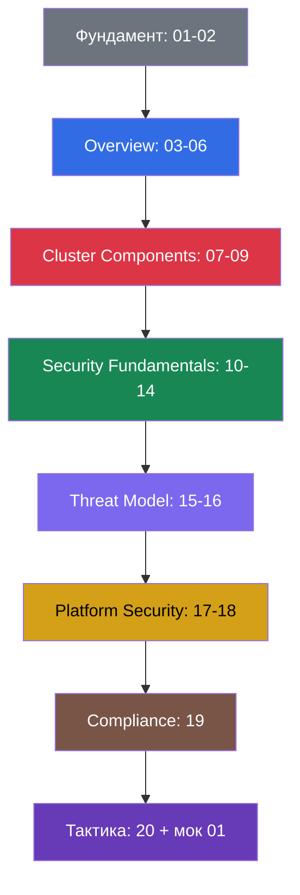

> **Язык:** русский. Переводы будут добавлены после публикации соответствующих файлов.

# Путеводитель по подготовке к KCSA

[← Оглавление курса](README_RU.md) · [Глоссарий](GLOSSARY_RU.md)

Этот маршрут собирает материал для **KCSA (Kubernetes and Cloud Native Security Associate)** - концептуальной associate-сертификации по безопасности cloud native и Kubernetes. Домены и веса соответствуют LIVE-программе LF на 2026-09-01; правила отслеживания изменений описаны в [политике версий](../VERSION_POLICY.md).

> **Формат экзамена.** KCSA - remote proctored экзамен с выбором ответа: около 60 вопросов за 90 минут, без hands-on заданий. По состоянию на 2026-09-01 LF Multiple Choice FAQ указывает проходной балл `75% or above`; перед регистрацией обязательно повторно проверьте актуальные требования LF. Тактика, тайм-менеджмент и чеклист собраны в [главе 20](20/ru.md).

> **О ссылках на CKA и CKS.** Ссылки на главы CKA и CKS ниже и далее в курсе ведут на соседние курсы этого репозитория как необязательное дополнительное чтение; они не входят в состав самостоятельного архива KCSA.

## С чего начать

KCSA не требует пререквизитов. Полезно базово понимать `Pod`, `Deployment`, `Service` и `kubectl`; нужный контекст безопасности курс объясняет самостоятельно. Если хочется заранее подтянуть Kubernetes, используйте как необязательную навигацию [SecurityContext и capabilities](../../cka/course/20/ru.md), [ServiceAccount и admission](../../cka/course/21/ru.md), [NetworkPolicy](../../cka/course/34/ru.md), [RBAC](../../cka/course/38/ru.md) и [TLS, kubeconfig и CSR](../../cka/course/39/ru.md).

Начните с [глав 01-02](01/ru.md), затем проходите домены в указанном порядке. Для следующего практического уровня используйте [курс CKS](../../cks/course/README_RU.md).

## Домены KCSA и главы

### 🟦 Overview of Cloud Native Security - 14%

- [03. 4C облачной безопасности](03/ru.md)
- [04. Безопасность облачного провайдера и инфраструктуры](04/ru.md)
- [05. Средства контроля, фреймворки и техники изоляции](05/ru.md)
- [06. Безопасность артефактов, образов и кода](06/ru.md)

### 🟥 Kubernetes Cluster Component Security - 22%

- [07. Безопасность control plane](07/ru.md)
- [08. Безопасность узла](08/ru.md)
- [09. Pod, сеть контейнеров, storage и клиентская безопасность](09/ru.md)

### 🟩 Kubernetes Security Fundamentals - 22%

- [10. Аутентификация и авторизация](10/ru.md)
- [11. Pod Security Standards и Pod Security Admission](11/ru.md)
- [12. Secrets](12/ru.md)
- [13. Network Policy, изоляция и сегментация](13/ru.md)
- [14. Audit Logging](14/ru.md)

### 🟪 Kubernetes Threat Model - 16%

- [15. Границы доверия, потоки данных и модель угроз](15/ru.md)
- [16. Категории угроз Kubernetes](16/ru.md)

### 🟨 Platform Security - 16%

- [17. Supply chain, реестры образов и admission control](17/ru.md)
- [18. Observability, PKI, connectivity и service mesh](18/ru.md)

### 🟫 Compliance and Security Frameworks - 10%

- [19. Комплаенс и фреймворки безопасности](19/ru.md)

## Компетенция → глава

| Домен | Компетенция | Главы |
|---|---|---|
| Overview of Cloud Native Security | The 4Cs of Cloud Native Security | [03](03/ru.md) |
| Overview of Cloud Native Security | Cloud Provider and Infrastructure Security | [04](04/ru.md) |
| Overview of Cloud Native Security | Controls and Frameworks | [05](05/ru.md), [19](19/ru.md) |
| Overview of Cloud Native Security | Isolation Techniques | [05](05/ru.md), [13](13/ru.md) |
| Overview of Cloud Native Security | Artifact Repository and Image Security | [06](06/ru.md), [17](17/ru.md) |
| Overview of Cloud Native Security | Workload and Application Code Security | [06](06/ru.md) |
| Kubernetes Cluster Component Security | API Server | [07](07/ru.md) |
| Kubernetes Cluster Component Security | Controller Manager | [07](07/ru.md) |
| Kubernetes Cluster Component Security | Scheduler | [07](07/ru.md) |
| Kubernetes Cluster Component Security | Etcd | [07](07/ru.md) |
| Kubernetes Cluster Component Security | Kubelet | [08](08/ru.md) |
| Kubernetes Cluster Component Security | Container Runtime | [08](08/ru.md) |
| Kubernetes Cluster Component Security | KubeProxy | [08](08/ru.md) |
| Kubernetes Cluster Component Security | Pod | [09](09/ru.md) |
| Kubernetes Cluster Component Security | Container Networking | [09](09/ru.md) |
| Kubernetes Cluster Component Security | Storage | [09](09/ru.md) |
| Kubernetes Cluster Component Security | Client Security | [09](09/ru.md) |
| Kubernetes Security Fundamentals | Pod Security Standards | [11](11/ru.md) |
| Kubernetes Security Fundamentals | Pod Security Admissions | [11](11/ru.md) |
| Kubernetes Security Fundamentals | Authentication | [10](10/ru.md) |
| Kubernetes Security Fundamentals | Authorization | [10](10/ru.md) |
| Kubernetes Security Fundamentals | Secrets | [12](12/ru.md) |
| Kubernetes Security Fundamentals | Isolation and Segmentation | [13](13/ru.md) |
| Kubernetes Security Fundamentals | Audit Logging | [14](14/ru.md) |
| Kubernetes Security Fundamentals | Network Policy | [13](13/ru.md) |
| Kubernetes Threat Model | Kubernetes Trust Boundaries and Data Flow | [15](15/ru.md) |
| Kubernetes Threat Model | Persistence | [16](16/ru.md) |
| Kubernetes Threat Model | Denial of Service | [16](16/ru.md) |
| Kubernetes Threat Model | Malicious Code Execution and Compromised Applications in Containers | [16](16/ru.md) |
| Kubernetes Threat Model | Attacker on the Network | [16](16/ru.md) |
| Kubernetes Threat Model | Access to Sensitive Data | [16](16/ru.md) |
| Kubernetes Threat Model | Privilege Escalation | [16](16/ru.md) |
| Platform Security | Supply Chain Security | [17](17/ru.md) |
| Platform Security | Image Repository | [17](17/ru.md) |
| Platform Security | Observability | [18](18/ru.md) |
| Platform Security | Service Mesh | [18](18/ru.md) |
| Platform Security | PKI | [18](18/ru.md) |
| Platform Security | Connectivity | [18](18/ru.md) |
| Platform Security | Admission Control | [17](17/ru.md) |
| Compliance and Security Frameworks | Compliance Frameworks | [19](19/ru.md) |
| Compliance and Security Frameworks | Threat Modelling Frameworks | [15](15/ru.md), [19](19/ru.md) |
| Compliance and Security Frameworks | Supply Chain Compliance | [19](19/ru.md) |
| Compliance and Security Frameworks | Automation and Tooling | [19](19/ru.md) |

## Домен → мок/вопросы

Доступный английский мок [01](../mock/01/README.md) содержит 60 MCQ-вопросов. Распределение следует весам LIVE-программы LF.

| Домен | Вес | Вопросов (≈) | Мок |
|---|---:|---:|---|
| Overview of Cloud Native Security | 14% | 8 | [01](../mock/01/README.md) |
| Kubernetes Cluster Component Security | 22% | 13 | [01](../mock/01/README.md) |
| Kubernetes Security Fundamentals | 22% | 13 | [01](../mock/01/README.md) |
| Kubernetes Threat Model | 16% | 10 | [01](../mock/01/README.md) |
| Platform Security | 16% | 10 | [01](../mock/01/README.md) |
| Compliance and Security Frameworks | 10% | 6 | [01](../mock/01/README.md) |
| **Итого** | **100%** | **60** | [Каталог моков](../mock) |

## Рекомендуемый порядок подготовки

После каждого домена отвечайте на вопросы для самопроверки, а после главы 20 проходите мок под таймером. Ошибки группируйте по доменам и возвращайтесь к связанным главам, а не запоминайте только правильный вариант.
